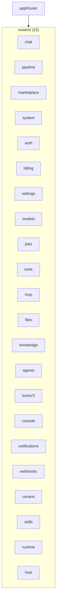
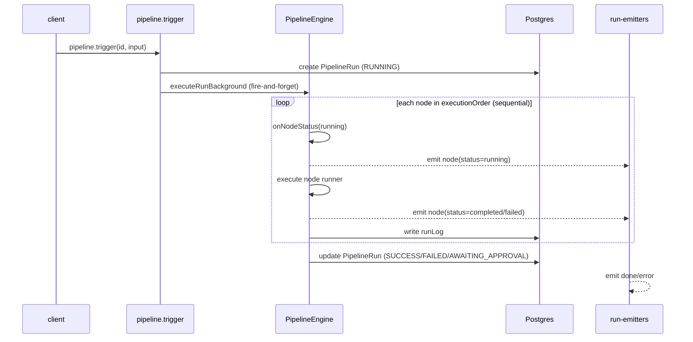

# Backend (apps/api)

`apps/api` is the single backend composition root: a Fastify v4 server exposing
a tRPC v11 router plus a small REST surface. This document covers the router
composition, the service layer, middleware/auth/rate-limiting, the config and
env model, the boot sequence, and the async pipeline execution model.

Sibling documents: [overview.md](./overview.md), [system.md](./system.md),
[api.md](./api.md), [database.md](./database.md),
[integrations.md](./integrations.md), [frontend.md](./frontend.md).

---

## Fastify + tRPC composition

`apps/api/src/index.ts` builds a Fastify server and registers:

- `helmet` (CSP only in production)
- `cors` (allows `APP_URL`, `http://localhost:3000`, `http://localhost:4000`)
- `@fastify/rate-limit` (global, Redis-backed when Redis is reachable)
- `fastifyTRPCPlugin` at prefix `/trpc` with `router: appRouter` and
  `createContext`

`apps/api/src/routers/index.ts` composes the app router from **22 sub-routers**
(verified). They are, in definition order:

1. `chat`
2. `pipeline`
3. `marketplace`
4. `system`
5. `auth`
6. `billing`
7. `settings`
8. `models`
9. `jobs`
10. `tools`
11. `mcp`
12. `files`
13. `knowledge`
14. `agents`
15. `toolsV2` (exposed as `toolsV2`)
16. `console`
17. `notifications`
18. `webhooks`
19. `context`
20. `skills`
21. `runtime`
22. `host`

The API is built by `tsup` into a single-file bundle `dist/index.js` and run via
`node dist/index.js`; dev uses `tsx watch src/index.ts` (see `apps/api/package.json`).

---

## Service layer (`apps/api/src/services`)

| Service | File | Role |
|---------|------|------|
| `ChatService` | `ChatService.ts` | Runs the agent loop (`sendMessageWithAgentLoop`) with context enrichment and a fallback to agent-runtime |
| `chatService` | `index.ts` | Singleton export of `ChatService` |
| `MetricsService` | `MetricsService.ts` | System/framework/process metrics |
| active-runs | `active-runs.ts` | In-memory map of `runId → AbortController` for cancellation |
| run-recovery | `run-recovery.ts` | Recovers orphaned `RUNNING` pipeline runs after restart |
| context-engine | `context-engine.ts` | Singleton `ContextEngine` for RAG |
| run-emitters | `run-emitters.ts` | Per-run `EventEmitter` for SSE pipeline streaming |
| session-emitters | `session-emitters.ts` | Per-session `EventEmitter` for SSE chat streaming |
| cron-scheduler | `cron-scheduler.ts` | node-cron scheduling for jobs |
| group-access | `group-access.ts` | Org/group membership checks (`userGroupRoles`) |
| host-auth | `host-auth.ts` | Host-client token verification (`verifyHostClientToken`) |
| mcp-client | `mcp-client.ts` | Discovers MCP tools for a user (`listMcpAgentToolsForUser`) |

### ChatService behavior (verified)

- `sendMessage` — saves the user message, enriches content with up to 3 context
  chunks from `ContextEngine`, then calls the **agent-runtime** `POST /chat/send`
  (Bearer `AGENT_API_KEY`) with a 30s timeout, through a circuit breaker
  (`CircuitBreaker(3, 30000)`) plus retry (`withRetry`). On failure it falls
  back to a graceful message.
- `sendMessageWithAgentLoop` — prefers a local LLM agent loop via
  `runAgentLoop` (regex protocol `CALL_TOOL` / `FINAL_ANSWER`) over the provider
  facade, with tool set from `buildChatTools` (non-destructive tools + MCP
  tools). Falls back to agent-runtime on error. Emits step/done/error to the
  session emitter for SSE.

### active-runs & run-recovery

- `active-runs.ts` keeps an in-memory `Map<runId, AbortController>`. `registerActiveRun`
  / `unregisterActiveRun` / `getActiveRunController` / `isRunActive`.
- `run-recovery.ts` (`recoverOrphanedRuns`) finds `PipelineRun` rows stuck in
  `RUNNING` whose run id is no longer active, marks them `FAILED` with the note
  `"Orphaned run recovered after restart"`, writes a `runLog`, and emits an
  error to the run emitter. `startRunRecovery()` runs it once at boot and every
  5 minutes.

---

## Middleware, auth, and rate limiting

`apps/api/src/middleware/`:

- `context.ts` — `createContext` reads the `Authorization` header. It first
  tries `verifyHostClientToken` (host clients), then a JWT verify against
  `JWT_SECRET` to set `userId`. Returns `{ prisma, userId, hostClient, req, res }`.
- `trpc.ts` — defines `publicProcedure`, `protectedProcedure` (= authed +
  rate-limit + usage-limit), and `adminProcedure`.

Per-tier rate limiting (`enforceRateLimit`, Redis-backed `KeyValueStore` with
memory fallback):

| Tier | Limit |
|------|-------|
| FREE | 60 / min |
| PRO | 200 / min |
| else (TEAM/ENTERPRISE) | 500 / min |

`enforceUsageLimits` checks POST (mutation) limits: chats-per-month and
pipeline-node counts from `getTierConfig`.

The global `@fastify/rate-limit` (in `index.ts`) defaults to `RATE_LIMIT_MAX`
(200) per `RATE_LIMIT_WINDOW` (1 minute), keyed by user id when present.

JWT secret (`apps/api/src/lib/jwt-secret.ts`): **production refuses a fallback
secret** — `resolveJwtSecret()` throws if `JWT_SECRET` is unset in production.

Credential crypto (`apps/api/src/lib/crypto.ts`): AES-256-GCM with `ENCRYPTION_KEY`;
a deterministic dev key is used if `ENCRYPTION_KEY` is unset outside production,
and production throws if it is missing.

---

## Configuration model (`apps/api/src/lib/config.ts`)

`config.ts` loads `.env` from several candidate paths, then parses a typed
schema with zod. Key env aliases:

- **LLM provider keys** accept both `*_KEY` and `*_API_KEY` forms, e.g.
  `OPENAI_API_KEY | OPENAI_KEY`, `ANTHROPIC_API_KEY | ANTHROPIC_KEY`,
  `GROQ_API_KEY | GROQ_KEY`, etc. (16 providers), plus `VENICE_AI_KEY`.
- `OLLAMA_BASE_URL | OLLAMA_URL` defaulting to `http://localhost:11434`.
- `AGENT_API_KEY | INTERNAL_API_KEY | INTERNAL_API_TOKEN`.
- `DATABASE_URL`, `REDIS_URL`, `JWT_SECRET`, `ENCRYPTION_KEY`, `APP_URL`,
  `API_URL`, `NODE_ENV`, `SENTRY_DSN`.
- `AGENT_RUNTIME_URL` defaulting to `http://localhost:8001`.

### Provider keys and env wiring

- `apps/api/src/lib/llm-keys.ts` (`buildLLMConfig`) merges env keys with the
  in-memory `providerRegistry`: for each of 16 providers, if no env key is set,
  it pulls `providerRegistry.getApiKey(providerId)` (set at boot from the DB).
- `apps/api/src/lib/llm-factory.ts` (`buildLLMProvider` + `normalizeGraph`)
  builds an `LLMProvider` from config and normalizes Stored front-end graphs
  into engine `PipelineGraph`s (mapping `engineType` → `type`).

---

## Boot sequence (`apps/api/src/index.ts`)

1. Load env (dotenv) and conditionally init Sentry.
2. Read `API_PORT` (default 3001) and `API_HOST`.
3. Create Fastify, register `helmet`, `cors`, `@fastify/rate-limit`.
4. Probe Redis (`isRedisUp`); register `fastifyTRPCPlugin` at `/trpc`.
5. Register REST routes (health, metrics, SSE streams, internal endpoints,
   Stripe webhook).
6. Register built-in tools into `toolRegistry`.
7. **Boot actions:**
   - `loadProviderCredentialsFromDb()` — decrypts `ProviderCredential` rows
     (AES-256-GCM) and calls `providerRegistry.setApiKey`.
   - `server.listen({ port, host })`.
   - `cronScheduler.start()`.
   - `startRunRecovery()`.
8. Graceful shutdown on SIGINT/SIGTERM (stop run recovery, stop cron, close
   server, disconnect Prisma, close Redis).

---

## Async pipeline model

`pipeline.trigger` (see `api.md`) creates a `PipelineRun` (status `RUNNING`),
registers an active run with an `AbortController`, and fires
`executeRunBackground` **without awaiting it** (`void executeRunBackground(...)`).
The run then executes in the background:

Key points (verified in `apps/api/src/routers/pipeline.ts` and
`packages/pipeline-engine/src/engine.ts`):

- **Sequential execution.** The engine iterates
  `plan.executionOrder` (Kahn topological sort) in a simple `for ... of` loop.
  `WorkflowSettings.executionOrder: "parallel"` is parsed but not honored.
- **Cancellation** is via the `AbortController`; `pipeline.cancelRun` sets the
  run to `CANCELLED`, aborts the controller, and unregisters it.
- **Approval** — `humanApproval` returns `awaiting_approval` unless a
  `requestApproval` callback is provided. In `executeRunBackground` the callback
  returns `{ approved: false, note: "Run paused awaiting manual approval" }`, so
  runs pause. `pipeline.resume` re-executes with `approvalOverrides`.
- **Run logs** are flushed per node via `onNodeStatus`.
- **Run recovery** catches orphaned runs left `RUNNING` after a restart.

> Caveat on `batchTrigger` / `resume`: `batchTrigger` runs up to 4 worker
> `PipelineEngine.execute` calls concurrently (concurrency across runs, not
> within a single graph). `resume` re-executes the whole graph with overrides.

---

## Internal / REST surface

Beyond tRPC, the API exposes (all in `apps/api/src/index.ts`):

- `GET /health` — returns status, version `0.1.0`, uptime, and `checks`
  (`database`, `agentRuntime`). 503 if DB probe fails.
- `GET /metrics` — Prometheus metrics, Bearer-gated.
- `GET /api/chat/stream/:sessionId` (SSE) — JWT via `Authorization`; verifies
  session ownership.
- `GET /api/pipeline/stream/:runId` (SSE) — JWT via `Authorization`; enforces
  owner or group membership.
- `POST /api/internal/create-pipeline`, `POST /api/internal/execute-tool` —
  require `AGENT_API_KEY`/`INTERNAL_API_KEY` (deny-by-default).
- `POST /api/stripe/webhook` — raw-body, signature verified by `BillingService`.

Internal endpoints and `/metrics` are denied when the internal token is not
configured (metrics additionally allowed in non-production dev).
