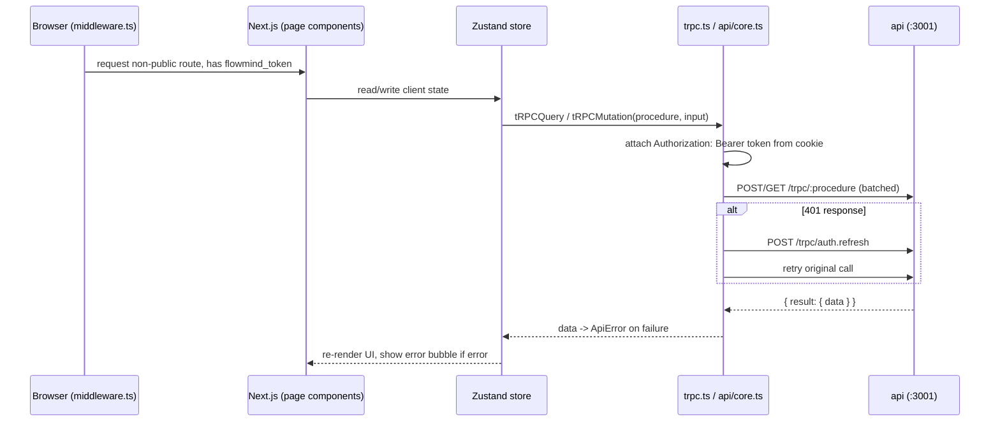

# Frontend (apps/web)

The web front end is a Next.js 14.2.35 application (`react: ^18.3.0`) with a
server-rendered shell and client-side state. It talks to the API only over HTTP:
tRPC (v11) batching at `/trpc`, plus SSE streams for chat and pipeline runs.

Sibling documents: [overview.md](./overview.md), [system.md](./system.md),
[api.md](./api.md), [backend.md](./backend.md).

---

## Frameworks and build

From `apps/web/package.json` and `apps/web/next.config.js`:

| Concern | Setting |
|---------|---------|
| Dev port | 3000 (`next dev --port 3000`) |
| Output | `standalone` |
| Transpile | `@flowmind/shared`, `@flowmind/db`, `@flowmind/ui` (`transpilePackages`) |
| Output tracing | `outputFileTracingRoot: path.join(__dirname, "../../")` |
| Optimized imports | `lucide-react` |
| State | Zustand (v4) + React Query |
| tRPC client | v11 (`@trpc/client`, `@trpc/react-query`) |
| Icons | lucide-react (project rule: use Lucide icons, never emoji strings) |
| Canvas | React Flow (`reactflow: ^11.11.4`) |

---

## Route groups

The following route groups exist under `apps/web/src/app` (verified by listing
the directory). Notable ones:

| Route | Purpose |
|-------|---------|
| `/` (`page.tsx` + `home/`) | Landing / dashboard (overview) |
| `/login`, `/forgot-password`, `/reset-password` | Auth screens (no `auth/` group) |
| `/chat` | AI chat workspace |
| `/pipelines/[id]` + `/pipelines` | Pipeline builder + list |
| `/marketplace/[id]` + `/marketplace` | Flow marketplace |
| `/settings` | Settings page with **13 tabs** (see below) |
| `/agents` | Agents |
| `/runtimes`, `/frameworks/[id]` | Runtime / framework management |
| `/knowledge`, `/context`, `/system`, `/jobs`, `/models`, `/mcp`, `/templates`, `/files` | Domain areas |
| `/tools`, `/tools-v2` | Tool management (v1 + v2) |
| `/workspace`, `/processes`, `/governance` | Workspace / process management |
| `/host-connect`, `/install`, `/install.sh`, `/docs` | Hosting / installation / docs |
| `/api` | Next.js API routes |

A route group named `overview` does **not** exist; the dashboard/overview is
served by the root `page.tsx` and the `home/` group. A top-level `skills/` route
group also does not exist — the `skills.ts` module in `src/lib/api` fronts the
`skills.*` tRPC procedures instead.

### Settings tabs (13)

`apps/web/src/app/settings/page.tsx` renders these tabs (lazy-loaded):

1. Profile
2. Appearance
3. AI & Models
4. Local Models
5. Memory
6. API Keys
7. Connections
8. Cron Jobs
9. Notifications
10. Organization
11. Billing
12. Security
13. Danger Zone

---

## Auth

- `apps/web/src/middleware.ts` is a Next.js middleware that protects routes. It
  checks for `flowmind_token` or `flowmind_session` cookies; unauthenticated
  requests redirect to `/login?redirect=<pathname>`.
- Public routes: `/login`, `/forgot-password`, `/reset-password`, `/install`,
  `/docs` (plus static assets). `/` and `/install.sh` are always allowed.

---

## tRPC client and API layer

- `apps/web/src/lib/trpc.ts` creates a `createTRPCClient<AppRouter>` with an
  `httpBatchLink` to `${API_URL}/trpc`, attaching `Authorization: Bearer
  <token>` from the cookie.
- `apps/web/src/lib/api/core.ts` centralizes cookie handling:
  - `getToken()` / `setToken()` for `flowmind_token` (15-min max age)
  - `getRefreshToken()` / `setRefreshToken()` for `flowmind_refresh`
    (7-day max age)
  - `setUserCookie()` / `clearAuth()` for `flowmind_user`
  - A custom `trpcCall` helper with 401 → auto-refresh via
    `auth.refresh`, an `ApiError` class carrying `code` + `httpStatus`, and
    network/parse error handling.
  - `tRPCQuery` / `tRPCMutation` and `*As` / `*AsHost` variants for acting as a
    given user or a host.
- `apps/web/src/lib/api/` holds 23 typed domain modules (verified listing):
  `agents.ts`, `auth.ts`, `billing.ts`, `chat.ts`, `console.ts`, `context.ts`,
  `core.ts`, `files.ts`, `host.ts`, `index.ts`, `jobs.ts`, `knowledge.ts`,
  `marketplace.ts`, `mcp.ts`, `models.ts`, `notifications.ts`, `pipeline.ts`,
  `runtime.ts`, `settings.ts`, `skills.ts`, `system.ts`, `tools.ts`,
  `webhooks.ts`.

---

## State (Zustand)

- `apps/web/src/hooks/chat-store.ts` — the chat store. Persists sessions and
  messages to `localStorage` under `flowmind_chat_data`. Runs an agent loop with
  a **90,000 ms stream timeout** (`MAX_STREAM_DURATION = 90_000`) and surfaces
  error bubbles on failed messages (messages carry an `error` flag).
- `apps/web/src/hooks/sidebar-store.ts` — controls the responsive sidebar.

There is no `store/` directory; stores live under `hooks/`.

---

## React Flow canvas and node configuration

- `apps/web/src/lib/pipeline-node-config.ts` maps engine node types to
  visual/UI types and icons:
  - `NODE_TYPE_MAP` — engine type → canvas node kind (`triggerNode`,
    `aiNode`, `actionNode`, `flowNode`).
  - `NODE_ICON_MAP` — engine type → Lucide icon name (e.g. `cronTrigger` →
    `Clock`, `aiAgent` → `Zap`, `parallelFork` → `ArrowRight`).
  - Helpers `getVisualType()` and `getIconName()` default to `actionNode` /
    `Zap`.
- `apps/web/src/lib/pipeline-templates.ts` — starter pipeline templates.

---

## Data flow: web → api

For chat and pipeline runs, the front end additionally opens SSE streams
(`/api/chat/stream/:sessionId`, `/api/pipeline/stream/:runId`) with the JWT in
the `Authorization` header to receive step / node / done / error events as they
happen.

---

## UI patterns

- Responsive sidebar (`hooks/sidebar-store.ts`).
- Loading skeletons (`loading.tsx` in route groups), empty states, and
  error-with-retry (`error.tsx` in route groups).
- Settings tabs are lazy-loaded with `Suspense`.
- All icons come from `lucide-react` per project convention.
