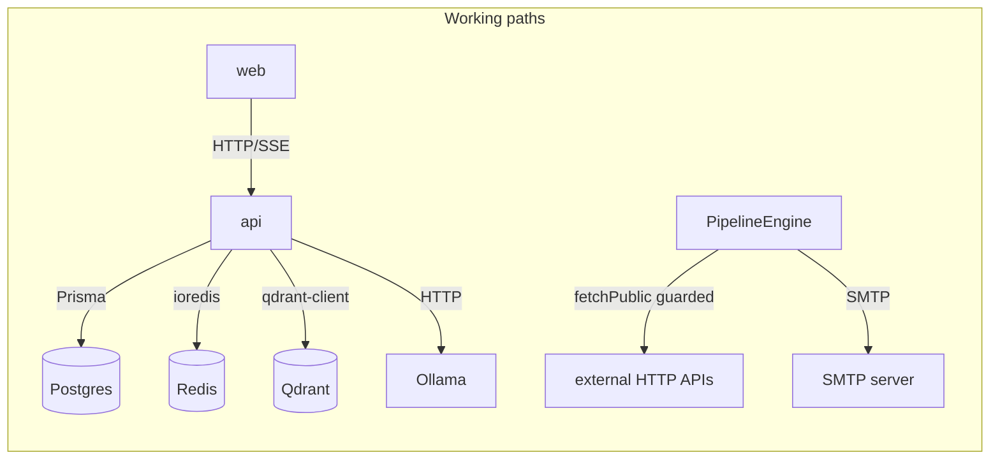
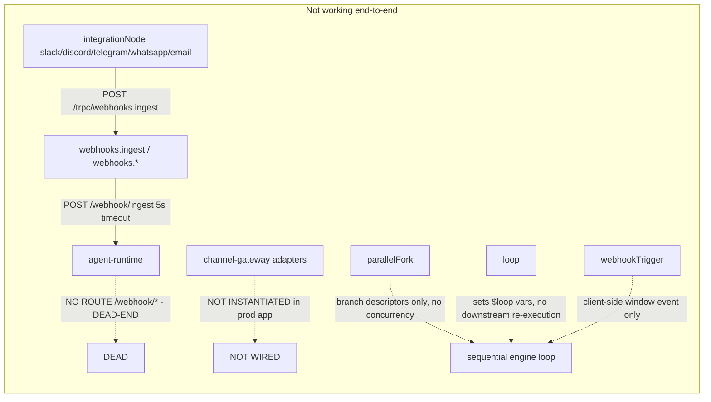

# External Integrations

This document is an honest status map of every external integration in the
FlowMind codebase: which are real and exercised, which are wired but untested,
which are stubs, and which are dead-ends.

Sibling documents: [overview.md](./overview.md), [system.md](./system.md),
[backend.md](./backend.md), [database.md](./database.md), [api.md](./api.md),
[deployment.md](./deployment.md).

---

## Status legend

- **VERIFIED** — real code path, exercised in the local dev environment.
- **WIRED, UNTESTED** — real code path exists, but no live credentials/keys
  were available to exercise it.
- **REAL CODE, NOT WIRED** — real API client code exists but is not wired into
  application boot / production flows.
- **STUB / PARTIAL** — declared endpoints or tools that throw or no-op.
- **DEAD-END** — a code path that forwards to a route that does not exist.

---

## Status table

| Integration | Status | Evidence / notes |
|-------------|--------|------------------|
| Ollama (local LLM + embeddings) | **VERIFIED** | Default `http://localhost:11434`; used by `llm-router` and `agent-runtime` (`/llm/generate`, embeddings with `all-minilm`) |
| Cloud LLM providers (16) | **WIRED, UNTESTED** | Env alias pairs in `apps/api/src/lib/config.ts`, full list in `llm-keys.ts`; no keys present locally |
| Stripe billing | **UNCONFIGURED** | Honest `"Billing is not configured. Contact the administrator."` error without `ENABLE_DEV_BILLING_MOCK=true` (dev only) in `apps/api/src/routers/billing.ts` |
| MCP servers (external) | **REAL CLIENT; TESTED ONLY AGAINST LOCAL DEMO** | `@modelcontextprotocol/sdk` transports stdio/streamable-http/SSE; `McpConnectionPool`/`McpToolRouter`/`McpServerRegistry` in `packages/mcp-executor` |
| Channel providers (telegram/slack/discord/whatsapp/email/openhuman) | **REAL CODE, NOT WIRED** | Adapters exist in `packages/channel-gateway/src/adapters/`; tests cover them, but no adapter is instantiated in `apps/api` production boot |
| Webhook forward (inbound channels) | **DEAD-END** | `webhooks.ts` POSTs to `/webhook/ingest`; agent-runtime has no such route |
| Knowledge / RAG (Qdrant) | **VERIFIED (REAL)** | `flowmind_contexts` collection, 384-dim; `ContextEngine` search used by ChatService (top-3) and pipeline `ragSearch` |
| SMTP email | **VERIFIED (REAL)** | Per-user `smtp` credential or `SMTP_*` env; pipeline `sendEmail` runner; tested via local SMTP capture |
| OAuth PKCE (github/slack/google/notion) | **REAL, NOT CONSUMED** | `initiateOAuthFlow` exists; tokens stored in `McpToken` but not consumed into connectors |

---

## Real data-flow paths (current, working)



- **Database, Redis, Qdrant, Ollama** — all real and exercised locally.
- **Pipeline `httpRequest` / `integrationNode` http|api** — real, via
  `fetchPublic` (SSRF-guarded).
- **Pipeline `sendEmail`** — real: per-user `smtp` credential or `SMTP_*` env,
  verified against a local SMTP capture test.

---

## Stub / dead-end paths



### Dead-end: webhook forward

`apps/api/src/routers/webhooks.ts` → `forwardToAgentRuntime()`:

```ts
response = await fetch(`${agentUrl}/webhook/ingest`, { ... })
```

But `packages/agent-runtime/src/main.py` defines **no** `/webhook/*` handler.
The only routes are `/health`, `/models*`, `/knowledge*`, `/llm/generate`,
`/chat/*`. Inbound Telegram/Slack/Discord/WhatsApp payloads therefore cannot
reach any handler. There is also **no `GET` verification handshake** for
platforms that require one (`?hub.challenge`, etc.).

### Not wired: channel-gateway adapters

`packages/channel-gateway/src/adapters/` contains real client code:

- `telegram.ts`, `slack.ts`, `discord.ts`, `whatsapp.ts`, `email.ts`,
  `openhuman.ts`

All implement `ChannelAdapter` (with `send`, `receive`/normalizers,
`setupWebhook`). But the gateway is **not instantiated** anywhere in the
application production boot path (`apps/api/src`). The only places it appears
are its own tests.

### Stubs: many `flowmind.*` MCP built-in tools

`packages/mcp-executor/src/index.ts` declares ~20 built-in `flowmind.*` tools.
Verified `implemented: true` ones include `flowmind.files.read/write/search`,
`flowmind.code.execute/lint`, `flowmind.git.diff/commit`, `flowmind.web.fetch/search`,
`flowmind.email.send`. Verified `implemented: false` ones (throw
`"... is not implemented"`): `flowmind.git.pr`, `flowmind.db.query`,
`flowmind.slack.message`, `flowmind.github.issue`, `flowmind.notion.page`,
`flowmind.memory.search`, `flowmind.skill.run`, `flowmind.pipeline.trigger`,
`flowmind.image.generate`, `flowmind.audio.transcribe`.

---

## Per-integration details

### Ollama (VERIFIED)

- Endpoints used: `/api/chat`, `/api/embeddings` (`all-minilm`),
  `/api/tags` (model discovery).
- Config aliases `OLLAMA_BASE_URL | OLLAMA_URL`, default `http://localhost:11434`.
- The agent-runtime `/llm/generate` and the API-side `llm-router` both talk to
  Ollama directly.
- Docker compose (`deploy/docker-compose.yml`) maps `OLLAMA_HOST` to
  `host.docker.internal:11434` for the runtime container.

### Cloud LLM providers (WIRED, UNTESTED)

`apps/api/src/lib/config.ts` reads these key pairs
(`*_API_KEY | *_KEY`): openai, anthropic, google, groq, deepseek, openrouter,
together, mistral, perplexity, deepinfra, cerebras, xai, cohere, cloudflare,
venice-ai (`VENICE_AI_KEY`), alibaba. `buildLLMConfig` (llm-keys.ts) merges env
with `providerRegistry.getApiKey` (loaded at boot from the DB).

No provider keys are present in the local `.env`; these provider paths are
therefore **untested end-to-end**. The agent loop falls back to Ollama when no
cloud key is set (ChatService picks `openai` → `anthropic` → `ollama`, then the
first available provider).

### Stripe (UNCONFIGURED — honest error)

`apps/api/src/routers/billing.ts`:

- If `STRIPE_SECRET_KEY` is missing: `createCheckout` and
  `createPortalSession` throw `INTERNAL_SERVER_ERROR` with
  `"Billing is not configured. Contact the administrator."`.
- Dev-only escape hatch: `ENABLE_DEV_BILLING_MOCK=true` (and not production)
  upserts a `Subscription`/`OrgSubscription` row and returns a mock URL.
- `POST /api/stripe/webhook` is registered and verifies the
  `stripe-signature` header with `BillingService.handleStripeWebhook`; it is
  real code but has not been exercised against the Stripe API (no key).

### MCP (real client, tested against local demo only)

`packages/mcp-executor`:

- Client transports: stdio, streamable-http, SSE.
- Security: allowlist `MCP_ALLOWED_COMMANDS` + SSRF blocklist.
- OAuth PKCE initiated for `github/slack/google/notion`; tokens persisted in
  `McpToken` model (Postgres), but **not consumed back into connectors** —
  there is no path that uses the stored access token to drive a connector.
- The API exposes `mcp.*` procedures (`list`, `create`, `delete`, `toggle`,
  `tools`, `oauthInitiate`, `oauthCallback`, `execute`).

### Channel providers (REAL CODE, NOT WIRED)

Adapters (listed above) implement real HTTP API calls for each channel (e.g.
Telegram `call`, WhatsApp Graph API `call`, Email IMAP/SMTP client), with tests.
They are not part of the app boot path.

`setupWebhook` per adapter (verified):

- **telegram** — real, calls `setWebhook` on the Bot API.
- **openhuman** — real, `POST /webhooks` with `{ url, events: [...] }`.
- **slack / discord / whatsapp / email** — no-op stubs
  (`await Promise.resolve(url)`).

There is also no `GET` verification handshake route for Telegram/Slack/etc.
in `apps/api`.

### Inbound webhooks (DEAD-END)

The API's `webhooks.*` procedures parse and validate platform payloads, then
forward to the nonexistent agent-runtime `/webhook/ingest`. Also note the
pipeline `integrationNode` dispatches channel sends to
`POST /trpc/webhooks.ingest`, which lands in the same dead-end.

### Knowledge / RAG (VERIFIED, REAL)

- Qdrant collection `flowmind_contexts` (384-dim) is real; `ContextEngine`
  (TypeScript) and the runtime's `context_engine.py` both wrap it.
- Used in chat (top-3 context chunks) and pipeline RAG retrieval (top-5 /
  top-K, group-scoped).
- The Python runtime falls back to a JSON file
  (`data/knowledge_store.json`) with cosine similarity when `QDRANT_URL` is
  unset.

### SMTP email (VERIFIED, REAL)

- Pipeline `sendEmail` runner: per-user `smtp` credential
  (via `CredentialResolver`) or `SMTP_HOST`/`SMTP_PORT`/`SMTP_USER`/
  `SMTP_PASS`/`SMTP_FROM`/`SMTP_SECURE` env.
- `apps/api/src/lib/mailer.ts` (`sendMail`, `smtpConfigured`) is used by the
  auth password-reset flow.
- Exercised via a local SMTP capture test
  (`packages/pipeline-engine/src/__tests__/email.test.ts`).

### OAuth (REAL, NOT CONSUMED)

- Login SSO: `apps/api/src/routers/auth.ts` implements Google/GitHub OAuth
  (PKCE-style state nonce) plus SAML via `@flowmind/auth`.
- MCP OAuth: `mcp-executor` implements PKCE for github/slack/google/notion,
  storing tokens in `McpToken`. No connector consumes those tokens.
- SSO client IDs/secrets come from env (`GOOGLE_CLIENT_ID`, etc.); absent
  locally, so the SSO callbacks are untested end-to-end.

---

## Summary

Only four external integrations are **fully real and locally exercised**:
Ollama, Postgres/Redis/Qdrant (infra), SMTP (via local capture), and guarded
outbound HTTP. Everything else is either untested without credentials, not
wired into the app, or a documented dead-end. Treat the
`integrations.md` and [overview.md](./overview.md) stub callouts as the source
of truth for what works.