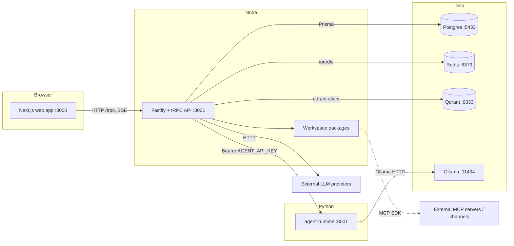
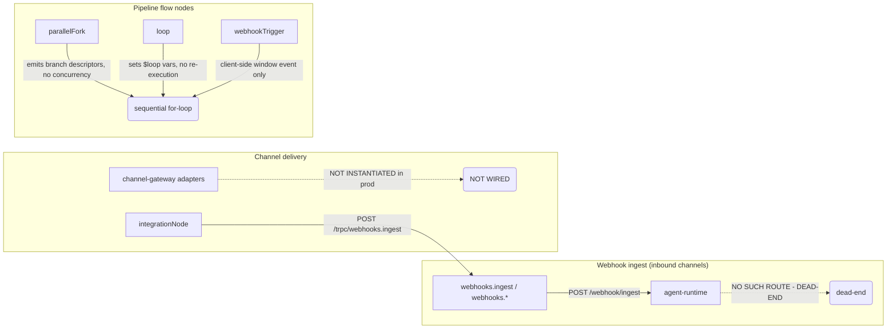

# FlowMind Architecture Overview

FlowMind is an AI workflow / automation platform. It lets users build and execute
"pipelines" — directed graphs of nodes (triggers, AI steps, actions, flow logic,
integrations) — and converse with an AI assistant that can use tools.

This document gives a 10,000-foot overview of the system. Companion documents
cover specifics:

- [system.md](./system.md) — monorepo layout, process topology, ports, request flow
- [frontend.md](./frontend.md) — the Next.js web application
- [backend.md](./backend.md) — the Fastify + tRPC API
- [database.md](./database.md) — Postgres / Redis / Qdrant / Ollama roles
- [api.md](./api.md) — the API contract
- [integrations.md](./integrations.md) — external integrations and their status
- [deployment.md](./deployment.md) — how things are (or are not) deployed

> All statements below were verified against the repository at commit time.
> Anything not confirmed is explicitly marked "unverified".

---

## The system in one picture

### What runs where

- **`apps/web`** — Next.js 14.2 SPA/SSR client. Talks to the API exclusively over
  HTTP: tRPC batching at `/trpc`, plus SSE streams for chat and pipeline runs.
- **`apps/api`** — Fastify server exposing a tRPC router (22 sub-routers) plus a
  handful of REST endpoints (`/health`, `/metrics`, SSE streams, internal tool
  execution, Stripe webhook). It is the single "composition root" that wires the
  workspace packages together.
- **`packages/*`** — ~23 TypeScript workspace packages (plus one Python runtime
  package, `packages/agent-runtime`) containing the reusable logic: pipeline
  execution, LLM routing, MCP client, tool system, context engine, auth, billing,
  channel gateways, Prisma schema, etc.
- **`packages/agent-runtime`** — an independent FastAPI/uvicorn service
  (port 8001) that performs LLM generation, model discovery, and knowledge
  retrieval. It is standalone: it calls Ollama directly and writes to a JSON
  knowledge file; the API calls into it for chat fallback and model ops.

### Data stores

| Store | Port | Owner | Purpose |
|-------|------|-------|---------|
| Postgres | 5433 (live) / 5432 (baked) | `packages/db` (Prisma, 46 models) | Primary relational store |
| Redis | 6379 | `apps/api/src/lib/redis.ts` | Rate limits, auth brute-force attempts, SSO state, ephemeral state |
| Qdrant | 6333 | `packages/context-engine` | Vector store (`flowmind_contexts`, 384-dim) |
| Ollama | 11434 | agent-runtime / llm-router | Local LLM chat + embeddings |

> The Postgres port discrepancy is real: the live local database listens on
> **5433**, while `.env.example`, `deploy/docker-compose.yml`, `infra/compose/*`,
> and `infra/k8s/*` bake **5432**. Local development must override `DATABASE_URL`
> to 5433 (see `docs/context/ai-context.md`).

---

## Known stubs / dead-ends

The following paths exist in code but are **not fully functional**. They are
called out honestly and detailed in [integrations.md](./integrations.md).

Highlights of the honest gaps:

1. **Webhook forward is a dead-end.** `apps/api/src/routers/webhooks.ts`
   (`forwardToAgentRuntime`) POSTs to `${AGENT_RUNTIME_URL}/webhook/ingest`, but
   `packages/agent-runtime/src/main.py` defines **no `/webhook/*` route**. Inbound
   channel messages therefore cannot reach any handler.
2. **Channel adapters are not wired.** `packages/channel-gateway` implements real
   API client code for telegram/slack/discord/whatsapp/email/openhuman, but no
   adapter is instantiated in production application code. `setupWebhook` makes a
   real API call only for **telegram** (`setWebhook`) and **openhuman**
   (`POST /webhooks`); **slack/discord/whatsapp/email** are no-op stubs
   (`await Promise.resolve(url)`). The only delivery path is the pipeline
   `integrationNode` writing to `webhooks.ingest`, which then hits the dead-end
   above.
3. **Pipeline `executionOrder: "parallel"` is not honored.** The engine always
   runs nodes in a strictly sequential for-loop over the Kahn topological order
   (`packages/pipeline-engine/src/engine.ts`).
4. **`parallelFork` has no concurrency.** It emits branch *descriptors*; it never
   spawns concurrent executions.
5. **`loop` does not re-execute downstream nodes.** It computes `$loop.*`
   variables and returns results, but the downstream graph is not iterated.
6. **`webhookTrigger` is client-side only.** It returns a path from a window
   event; there is no server-side webhook receiver wired to it.
7. **`humanApproval` returns `awaiting_approval`** unless a `requestApproval`
   callback is supplied; in the API the callback always returns not-approved, so
   runs pause awaiting manual approval.

---

## How a request typically flows

1. A user interacts with the web app.
2. The web app calls the API over tRPC (batched at `/trpc`) using a JWT in the
   `Authorization` header (stored in a `flowmind_token` cookie).
3. The API's Fastify hooks (`middleware/context.ts`) validate the JWT and attach
   a `userId` (and optional host-client identity). Per-tier rate limits and usage
   limits apply per procedure (`middleware/trpc.ts`).
4. The tRPC procedure calls into a service or directly into a workspace package
   (e.g. `ChatService`, `PipelineEngine`, `ContextEngine`).
5. Side effects persist to Postgres/Redis/Qdrant, call Ollama or external LLM
   providers, or fan out to the agent-runtime.

See [system.md](./system.md) and [backend.md](./backend.md) for detail.

---

## Honest status summary

- The **core** is real and runs in dev mode on localhost: web front end, tRPC
  API, Postgres/Redis/Qdrant via native binaries, Ollama for local inference,
  and pipeline graph execution.
- **Cloud LLM providers** are wired (16 in `llm-keys.ts`) but **untested** — no
  keys are present in the local environment.
- **Stripe billing** returns an honest "not configured" error unless
  `ENABLE_DEV_BILLING_MOCK=true` (dev only).
- **MCP** is a real client but has only been exercised against a local demo
  server.
- **Deployment artifacts exist** (Dockerfile, compose, k8s) but are **not
  validated**: Docker cannot run on the active dev box (no Hyper-V), so the
  current runtime is pure dev-mode localhost.
