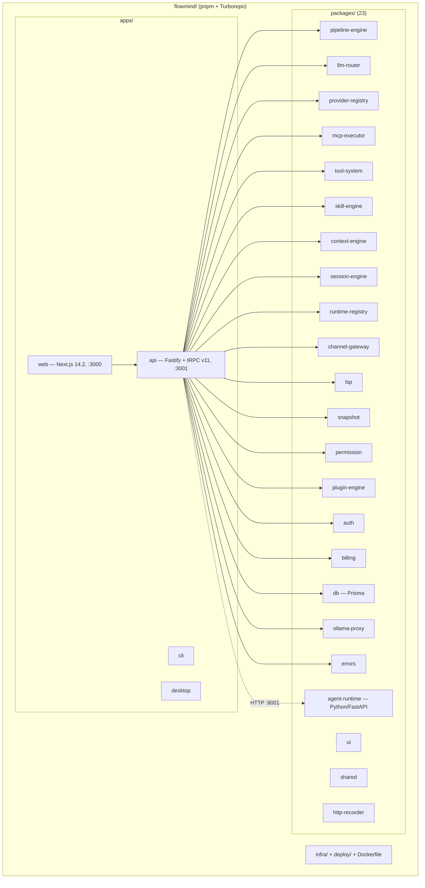
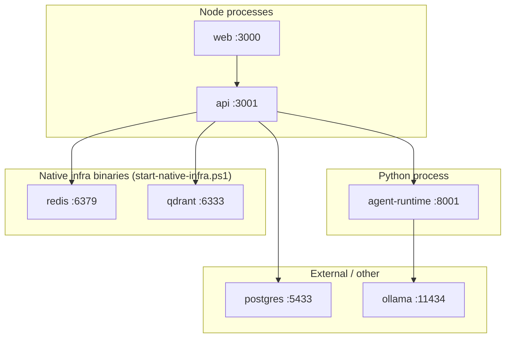
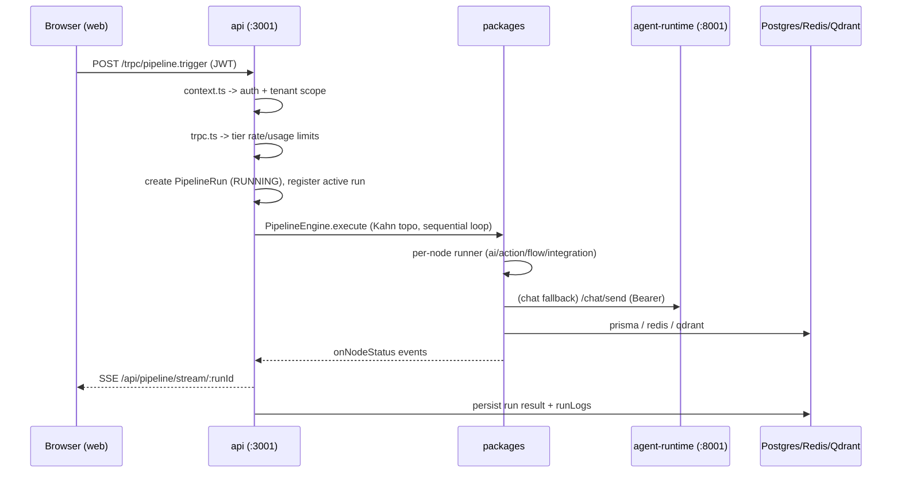

# System Architecture

This document covers the full system architecture of the FlowMind monorepo:
the monorepo component diagram, the process topology and ports, how requests
flow, and multi-process responsibilities. It also states the honest limitations
of the current runtime.

Sibling documents: [overview.md](./overview.md), [frontend.md](./frontend.md),
[backend.md](./backend.md), [database.md](./database.md), [api.md](./api.md),
[integrations.md](./integrations.md), [deployment.md](./deployment.md).

---

## Monorepo layout

Monorepo root: `pnpm@9.15.4` + Turborepo, Node >= 22
(`package.json` → `packageManager: "pnpm@9.15.4"`, `engines.node: ">=22.x"`).

### Apps

| App | Tech | Dev port | Build / run |
|-----|------|----------|-------------|
| `apps/web` | Next.js 14.2.35, React 18, tRPC v11 client, Zustand, React Flow | 3000 | `next dev --port 3000`; `output: "standalone"` |
| `apps/api` | Fastify v4 + tRPC v11 | 3001 | `tsx watch src/index.ts` (dev) / `node dist/index.js` (built via tsup single-file bundle) |
| `apps/cli` | — | — | CLI scaffold |
| `apps/desktop` | — | — | Desktop scaffold |

`apps/web/package.json` uses `next dev --port 3000`; `apps/api/package.json`
uses `tsx watch src/index.ts` for dev and `node dist/index.js` for the built
artifact. Confirm by reading `apps/api/package.json`.

### Packages (23 total)

The repository root `packages/` contains 23 directories (including the Python
`agent-runtime`). The TypeScript ones relevant to the backend are listed in the
diagram. Key roles:

- **pipeline-engine** — graph execution. Owns the 31-type `NodeType` union,
  Kahn topological sort (`graph.ts`), engines, runners, isolated-vm code
  sandbox, and SSRF network guard.
- **llm-router** — provider facade + agent loop (`CALL_TOOL` / `FINAL_ANSWER`
  regex protocol). Providers: openai/anthropic/google/ollama plus
  OpenAI-compatible clones (groq, deepseek, openrouter, together, mistral,
  azure-openai, perplexity, deepinfra, cerebras, xai, cohere, cloudflare,
  venice-ai, alibaba).
- **provider-registry** — 20 built-in providers; in-memory `getApiKey` set via
  `setApiKey`; env wiring happens downstream in
  `apps/api/src/lib/llm-keys.ts`.
- **mcp-executor** — a real MCP client via `@modelcontextprotocol/sdk`
  (stdio / streamable-http / SSE). Contains `McpConnectionPool`,
  `McpToolRouter`, `McpServerRegistry`, security allowlist
  (`MCP_ALLOWED_COMMANDS` + SSRF blocklist), OAuth PKCE for
  github/slack/google/notion, and many stub `flowmind.*` built-in tools.
- **tool-system** — real tools (read/write/edit/grep/glob/bash/webfetch/
  websearch/http_request/apply_patch/todowrite) behind a `ToolRegistry`
  singleton.
- **channel-gateway** — `ChannelAdapter` interface with adapters for
  telegram/slack/discord/whatsapp/email/openhuman; real API implementations but
  **not instantiated in app production code**. `setupWebhook` is a real API call
  for **telegram** and **openhuman** only; the other four are no-op stubs.
- **db** — Prisma schema (Postgres, 46 models) and client.
- **errors** — `FlowMindError` hierarchy with typed codes and status codes.
- **shared, ui** — shared types/constants and UI primitives.

---

## Process topology and ports

As actually implemented in dev mode (all localhost, native processes):

| Service | Process | Port | Notes |
|---------|---------|------|-------|
| Web | Node (Next.js) | 3000 | `output: standalone` |
| API | Node (Fastify + tRPC) | 3001 | built to `dist/index.js` via tsup |
| agent-runtime | Python (uvicorn) | 8001 | FastAPI; Bearer `AGENT_API_KEY` |
| Postgres | — | **5433 (live)** | 5432 in env.example/compose/k8s |
| Redis | native binary | 6379 | started by `infra/scripts/start-native-infra.ps1` |
| Qdrant | native binary | 6333 (+6334 gRPC) | vector store |
| Ollama | external | 11434 | local LLM + embeddings |

The native infra launcher lives at `infra/scripts/start-native-infra.ps1`. Its
comment cites the reason Docker is unavailable on the dev box:
`HCS_E_HYPERV_NOT_INSTALLED` (no Hyper-V).

---

## Multi-process responsibilities

### apps/api (the composition root)

The API process wires together all the workspace packages. Its `src/index.ts`:

- Registers Fastify plugins: `helmet`, `cors`, `@fastify/rate-limit` (Redis
  backed when reachable), and `fastifyTRPCPlugin` at prefix `/trpc` with
  `appRouter` and `createContext`.
- Registers REST endpoints:
  - `GET /health` — checks DB + agent-runtime.
  - `GET /metrics` — Prometheus metrics, Bearer-gated by
    `AGENT_API_KEY`/`INTERNAL_API_KEY`.
  - `GET /api/chat/stream/:sessionId` and `GET /api/pipeline/stream/:runId` —
    SSE streams, auth via `Authorization` header (JWT).
  - `POST /api/internal/create-pipeline` and
    `POST /api/internal/execute-tool` — internal, deny-by-default unless
    `AGENT_API_KEY`/`INTERNAL_API_KEY` matches.
  - `POST /api/stripe/webhook` — Stripe webhook with raw-body parsing and
    signature verification.
- Registers the base built-in tools (read/write/edit/grep/glob/bash/webfetch/
  websearch/http_request/apply_patch/todowrite) into `toolRegistry`.
- Boot sequence: load provider credentials from DB → listen → start cron
  scheduler → start run recovery.
- Graceful shutdown on SIGINT/SIGTERM.

### apps/web

Runs the Next.js client. It only issues HTTP to the API (tRPC batch + SSE). Auth
is cookie-based (`flowmind_token`/`flowmind_refresh`/`flowmind_user`); the API
is called with the token in the `Authorization` header (see `frontend.md`).

### agent-runtime (Python)

Endpoints (verified in `packages/agent-runtime/src/main.py`):

- `GET /health`
- `GET /models`, `GET /models/providers`, `POST /models/pull`,
  `POST /models/pull/status`, `GET /models/search`
- `POST /knowledge/index`, `/knowledge/search`, `/knowledge/delete`
- `POST /llm/generate`
- `POST /chat/send`, `POST /chat/stream`

It is **standalone** — it talks to Ollama directly and to Qdrant (when
`QDRANT_URL` is set) for knowledge; it does not call back into the API for
anything except nothing. The API calls **into** it (Bearer `AGENT_API_KEY`).

### Packages

Smaller in-process responsibilities: llm-router (agent loop), pipeline-engine
(graph execution), mcp-executor (external MCP), tool-system (tool suite),
context-engine (RAG), auth (JWT/SAML/MFA), billing (Stripe), etc.

---

## How requests flow

---

## Honest limits

- **Dev-mode only.** The active box runs everything as localhost native
  processes (see [deployment.md](./deployment.md)). Docker images are written
  but unvalidated because Docker cannot start (no Hyper-V).
- **Single local instance.** There is no production deployment to a live host;
  k8s manifests and compose files describe intended topology, not a running
  system.
- **Multiple single-process stores.** Redis and Qdrant run as local binaries;
  the in-memory fallback in `redis.ts` (`KeyValueStore`) covers single-process
  dev only and is not a distributed state store.
- **Channel/webhook paths are not end-to-end functional** (see
  [overview.md](./overview.md) and [integrations.md](./integrations.md)).
