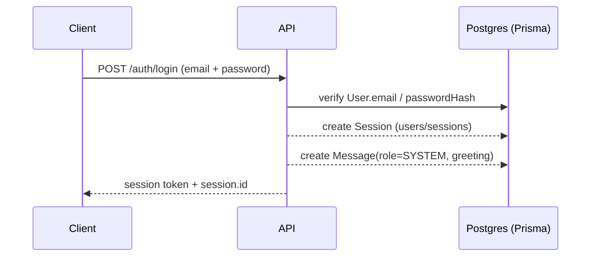
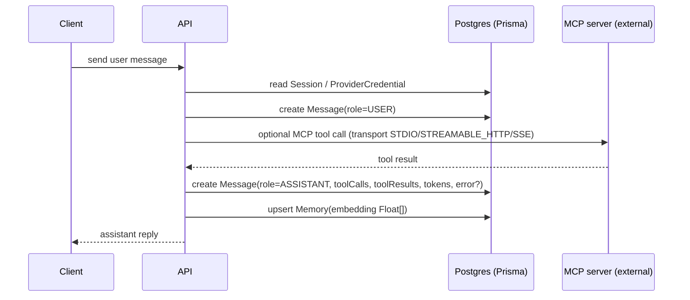
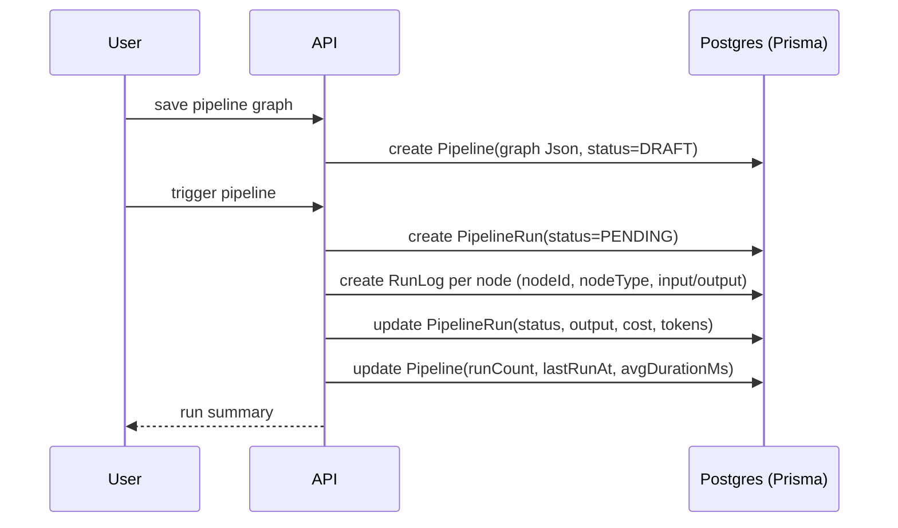
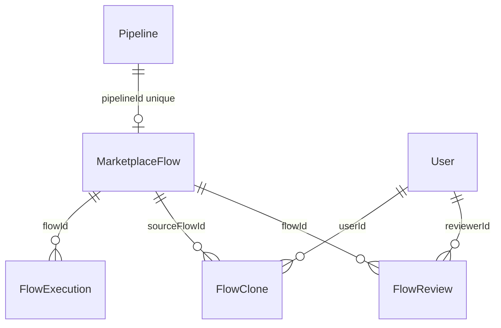
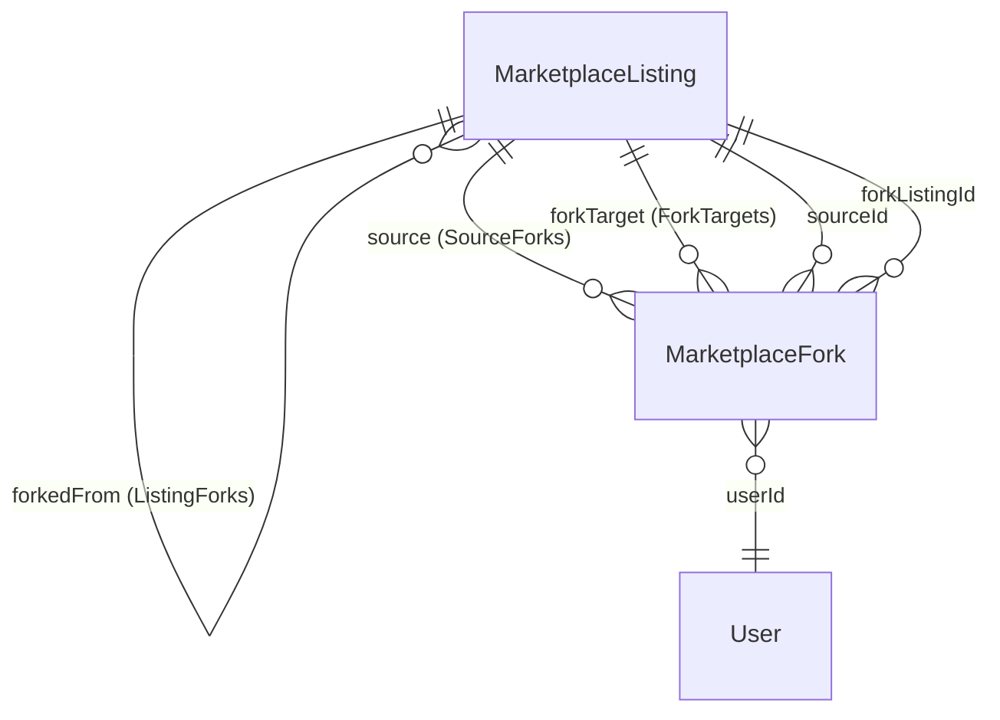
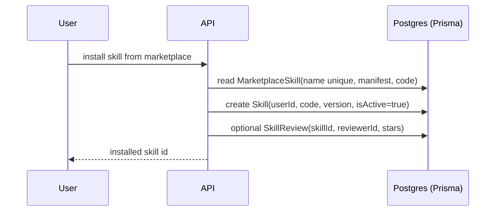
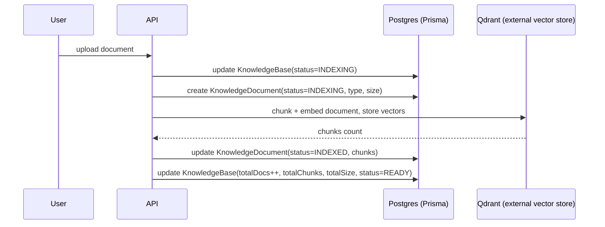

# Data Flow Reference

> Last verified against `packages/db/prisma/schema.prisma` on 2026-09-05.

This document traces how data moves through the major operations in FlowMind, grounded in the actual Prisma schema.

## 1. User Login

**Tables written, in order:**

1. `User` (users) -- read to verify `email` + `passwordHash`; optionally update `passwordResetToken`/`passwordResetExpiresAt` when using magic links.
2. `Account` (accounts) -- written when using OAuth providers; `@@unique([provider, providerAccountId])`.
3. `Session` (sessions) -- a new session row is created on login (`userId`, `title`, `embedding` as `Float[]`).
4. `Message` (messages) -- optional greeting/context message appended to the session.
5. `ApiKey` (api_keys) -- only for programmatic/agent access; stores `keyHash` + `lastFour`.

**Cascade cleanup:** Deleting a `User` does NOT cascade here -- the `User` has no `onDelete: Cascade` relations pointing from children (most default to the platform default, which for Postgres via Prisma is `Restrict`/`NoAction`). `Session`/`Message`/`Account`/`ApiKey` are not marked Cascade, so a user deletion would be constrained by these FKs.

## 2. Chat Turn

**Tables written, in order:**

1. `Session` (sessions) -- read to find the active session; optionally update `summary`/`title`.
2. `Message` (messages) -- one row per turn:
   - `role` (MessageRole) -- USER or ASSISTANT.
   - `content` -- the text payload.
   - `error` (Boolean, default false) -- set true when the turn failed.
   - `toolCalls` / `toolResults` (Json) -- tool invocation data when tools fire.
   - `model`, `provider`, `tokensIn`, `tokensOut`, `duration` -- telemetry.
3. `Memory` (memories) -- optional extraction of facts from the turn, with `embedding` Float[] for retrieval.
4. `ProviderCredential` (provider_credentials) -- read `encryptedValue` for the LLM provider (e.g. OpenAI, Anthropic).
5. `McpServer` (mcp_servers) -- read `command`/`args`/`baseUrl`/`headers` + `transport` when the turn invokes an MCP tool.

**Cascade cleanup:** `Message.session` is `onDelete: Cascade` -- deleting a `Session` deletes its messages. `Memory.session` is NOT Cascade (optional), so memories outlive session deletion.

## 3. Pipeline Create & Run

**Tables written, in order:**

1. `Pipeline` (pipelines) -- create with `graph` (Json), `status` (default DRAFT), `isActive` (false), and tags.
2. `PipelineRun` (pipeline_runs) -- created when a pipeline is triggered:
   - `status` PENDING -> RUNNING -> SUCCESS/FAILED/CANCELLED/AWAITING_APPROVAL.
   - `input` / `output` (Json).
   - `costCents`, `tokensIn`, `tokensOut`.
3. `RunLog` (run_logs) -- one row per DAG node executed within the run:
   - `nodeId`, `nodeType`, `input`, `output`, `error`, `duration`, `tokensIn/Out`, `costCents`.
4. `Pipeline` -- updated: `runCount` incremented, `lastRunAt`, `avgDurationMs`, `status` may promote to ACTIVE.

**Cascade cleanup:** `RunLog.run` is `onDelete: Cascade`. `PipelineRun.pipeline` is **NOT** marked Cascade, so deleting a `Pipeline` is constrained by existing runs. Deleting a `PipelineRun` cascades to its `RunLog` rows.

## 4. Marketplace Publish / Install

Two parallel flows exist in the schema. The legacy one (`MarketplaceFlow` + friends) wraps a `Pipeline`; the newer `MarketplaceListing` supports multiple item types with a fork chain.

### 4a. Publish via MarketplaceFlow

1. `MarketplaceFlow` (marketplace_flows) -- create with `pipelineId` (**@unique**, one flow per pipeline), `creatorId`, `title`, `category`, `price`, `isFeatured`, `isVerified`.
2. `FlowCategory` (flow_categories) -- reference for classification by `slug` (no FK).
3. Downstream: `FlowReview` (flow_reviews), `FlowClone` (flow_clones), `FlowExecution` (flow_executions).

### 4b. Publish/Install via MarketplaceListing + Fork Chain

1. `MarketplaceListing` (marketplace_listings) -- create with `type` (MarketplaceItemType), `ownerId`/`orgId`, `visibility`, `manifest`, `payloadRef`, `forkedFromId` (self-FK when forking).
2. `MarketplaceListingVersion` (marketplace_listing_versions) -- versioned manifests; `@@unique([listingId, version])`.
3. `MarketplaceFork` (marketplace_forks) -- created when someone forks: links `sourceId` and `forkListingId`, both FKs to `MarketplaceListing`.
4. `MarketplaceReview` (marketplace_reviews) -- one per reviewer per listing (`@@unique([listingId, reviewerId])`).
5. Install: the consumer typically creates their own `Pipeline` (or `Skill`) and records a `FlowClone` referencing `sourceFlowId` + a `clonePipelineId` (logical, no FK).

**Self-referential fork chain:**

Named relations:
- `ListingForks` -- self-referential parent/child on `MarketplaceListing.forkedFromId`.
- `SourceForks` -- `MarketplaceFork.sourceId` (a listing "owns" forks it spawned).
- `ForkTargets` -- `MarketplaceFork.forkListingId` (the derivative listing is the "target").

`MarketplaceFork.source` and `.forkListing` are both `onDelete: Cascade` -- deleting either side of a fork chain removes the fork record.

**Cascade cleanup:** `MarketplaceListingVersion`, `MarketplaceReview`, and `MarketplaceFork` all Cascade from their owning `MarketplaceListing`. The self-FK `forkedFrom` is NOT Cascade (optional, default behavior).

## 5. Skill Install

**Tables written, in order:**

1. `MarketplaceSkill` (marketplace_skills) -- canonical skill payload: `manifest` (Json), `code`, `version`, `tags`.
2. `SkillVersion` (skill_versions) -- created on each publish/install, `@@unique` not on skill+version but a versioned snapshot is captured per row.
3. `SkillReview` (skill_reviews) -- optional user reviews, `@@unique([skillId, reviewerId])`.
4. `Skill` (skills) -- the user's installed copy: `userId`, optional `groupId`, `code`, `version`, `isActive`, plus runtime counters `successRate`, `successCount`, `useCount`.

**Cascade cleanup:** `SkillVersion.skill` and `SkillReview.skill` are `onDelete: Cascade` off `MarketplaceSkill`. `SkillReview.reviewer` is not Cascade.

## 6. Knowledge Ingest (RAG)

**Tables written, in order:**

1. `KnowledgeBase` (knowledge_bases) -- create/read a base: `name`, `model` (embedding model, default `nomic-embed-text`), `status` (READY/INDEXING/ERROR), counters `totalDocs`, `totalChunks`, `totalSize` (BigInt).
2. `KnowledgeDocument` (knowledge_documents) -- one row per uploaded file:
   - `type` (DocumentType: PDF/TXT/MD/CSV/JSON)
   - `status` (Indexing -> INDEXED/ERROR)
   - `content` (raw text), `size`, `chunks`.
3. **Qdrant (external)** -- chunk embeddings are pushed to Qdrant, a separate vector store. **Qdrant is NOT a Prisma table.** Its data is not in Postgres; `KnowledgeDocument.totalChunks` and `KnowledgeBase.totalChunks` mirror the chunk count locally, but the actual vectors live in Qdrant.

**Cascade cleanup:** `KnowledgeDocument.kb` is `onDelete: Cascade` -- deleting a `KnowledgeBase` removes its documents. Qdrant vectors must be cleaned up by application code; Prisma knows nothing about them.

## Logical (Non-FK) Relations

Several models store owner/reference IDs as plain `String` columns with **no Prisma relation**. The following references are logical/implied and are not enforced by DB foreign keys:

| Model | Plain String column | Logical target |
|---|---|---|
| McpToken | userId | User |
| MarketplaceFlow | creatorId | User |
| FlowClone | clonePipelineId | Pipeline |
| FlowExecution | userId, pipelineRunId | User, PipelineRun |
| CreatorRevenue | creatorId, flowId | User, MarketplaceFlow |
| UsageRecord | subjectId (polymorphic) | User/Org/anything |
| FrameworkConfig | frameworkId | Framework (external) |
| FrameworkStatusRecord | userId, frameworkId | User, Framework |
| SystemMetricsLog | userId, frameworkId | User, Framework |
| AuditLog | orgId?, userId | Org, User |
| Subscription | userId (unique) | User |
| CronJob | userId, pipelineId | User, Pipeline |
| Notification | userId | User |
| Agent | userId | User |

Treat these as "owned by userId" in application code but be aware the database will not enforce referential integrity or cascade on delete for them.
