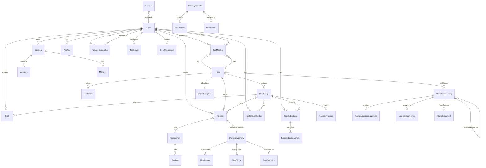

# Data Model Overview

> Last verified against `packages/db/prisma/schema.prisma` on 2026-09-05.

## Stack

- **ORM**: Prisma (generator `prisma-client-js`)
- **Database**: PostgreSQL (`datasource db { provider = "postgresql" }`)
- **Connection**: `env("DATABASE_URL")`

## Conventions

| Convention | Pattern | Example |
|---|---|---|
| Table names (in DB) | snake_case via `@@map` | `users`, `org_members`, `pipeline_runs` |
| Model names (in code) | PascalCase | `User`, `OrgMember`, `PipelineRun` |
| Primary keys | `String @id @default(cuid())` | All 46 models |
| Timestamps | `createdAt DateTime @default(now())`, `updatedAt DateTime @updatedAt` | Most models (see exceptions) |
| Field names | camelCase | `createdAt`, `userId`, `pipelineId` |

## Exceptions: Models Without Standard Timestamps

| Model | Timestamp columns present |
|---|---|
| `Message` | `createdAt` only (no `updatedAt`) |
| `FlowClone` | `clonedAt` only (no `createdAt`/`updatedAt`) |
| `FlowExecution` | `createdAt` only (no `updatedAt`) |
| `FlowCategory` | No timestamps at all |
| `PipelineProposalComment` | `createdAt` only (no `updatedAt`) |
| `FlowReview` | `createdAt` only (no `updatedAt`) |

## Scale

- **46 models**
- **17 enums**
- **Float[] embedding columns** on `Session.embedding` and `Memory.embedding` (for vector similarity search)

## Model Domains

### Identity & Auth (7)
`User`, `ProviderCredential`, `Account`, `Session`, `Message`, `ApiKey`, `Subscription`

### Org & Tenancy (6)
`Org`, `OrgMember`, `OrgSubscription`, `HostGroup`, `HostGroupMember`, `HostClient`

### Host Connections (1)
`HostConnection`

### Chat & Sessions
See Identity & Auth (`Session`, `Message`)

### Skills (5)
`Skill`, `MarketplaceSkill`, `SkillVersion`, `SkillReview`

### Memory (1)
`Memory`

### API Keys & Credentials
See Identity & Auth (`ApiKey`, `ProviderCredential`)

### MCP (2)
`McpToken`, `McpServer`

### Pipelines & Runs (5)
`Pipeline`, `PipelineProposal`, `PipelineProposalComment`, `PipelineRun`, `RunLog`

### Marketplace (10)
`MarketplaceFlow`, `FlowReview`, `FlowClone`, `FlowExecution`, `CreatorRevenue`, `FlowCategory`, `MarketplaceListing`, `MarketplaceListingVersion`, `MarketplaceReview`, `MarketplaceFork`

### Billing & Usage (2)
`OrgSubscription`, `UsageRecord`

### Framework & Agent Runtime (4)
`FrameworkConfig`, `FrameworkStatusRecord`, `SystemMetricsLog`, `Agent`

### Auditing (1)
`AuditLog`

### Notifications (1)
`Notification`

### Knowledge / RAG (2)
`KnowledgeBase`, `KnowledgeDocument`

### Cron (1)
`CronJob`

## Top-Level ER Diagram



## Migrations

Prisma migrations live at:

```
packages/db/prisma/migrations/
```

Each migration is a timestamped directory (e.g., `20260830010000_add_mcp_servers/`) containing a `migration.sql` file.

## Windows Development Caveats

1. **`prisma migrate dev` fails with P3014** on some Windows setups. Workaround: use `prisma db execute` for manual SQL or `prisma migrate deploy` after generating SQL externally.
2. **`prisma generate` requires the API to be stopped** -- the generated client writes into `node_modules` which can conflict with a running dev server.
3. **Port mapping**: the live local Postgres container typically binds to **5433** on the host, while `env.example`, `docker-compose.yml`, and Kubernetes manifests default to **5432**. Ensure `DATABASE_URL` points to the correct port for your environment.
