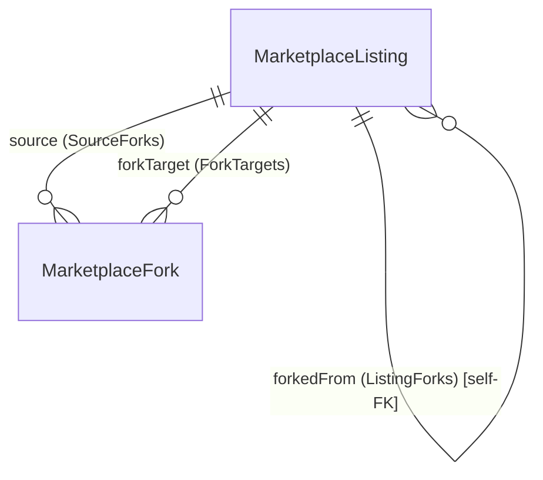
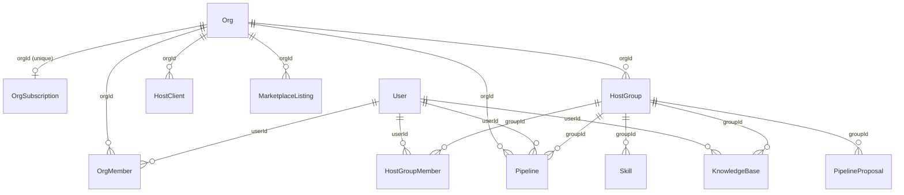

# Relationship Inventory

> Last verified against `packages/db/prisma/schema.prisma` on 2026-09-05.

## Scope

- 46 models, 17 enums.
- All ids are `String @id @default(cuid())`.
- One-to-many, many-to-many (via join tables), one-to-one, and self-referential relations.
- Certain models hold owner IDs as plain strings with **no foreign key** — these are "logical" relations and are called out explicitly.

## One-to-Many Relations (FK on the child)

| Parent | Child | FK column | onDelete |
|---|---|---|---|
| User | Session | Session.userId | default (not Cascade) |
| User | Message | Message.sessionId (via Session) | n/a |
| User | ApiKey | ApiKey.userId | default |
| User | Memory | Memory.userId | default |
| User | Pipeline | Pipeline.userId | default |
| User | Account | Account.userId | default |
| User | FrameworkConfig | FrameworkConfig.userId | default |
| User | FlowReview | FlowReview.reviewerId | default |
| User | SkillReview | SkillReview.reviewerId | default |
| User | FlowClone | FlowClone.userId | default |
| User | OrgMember | OrgMember.userId | default |
| User | MarketplaceListing | MarketplaceListing.ownerId | default |
| User | MarketplaceReview | MarketplaceReview.reviewerId | default |
| User | MarketplaceFork | MarketplaceFork.userId | default |
| User | HostGroupMember | HostGroupMember.userId | Cascade |
| User | HostConnection | HostConnection.userId | Cascade |
| User | KnowledgeBase | KnowledgeBase.userId | default |
| User | ProviderCredential | ProviderCredential.userId | default |
| User | McpServer | McpServer.userId | Cascade |
| User | Skill | Skill.userId | default |
| Org | OrgMember | OrgMember.orgId | default |
| Org | Pipeline | Pipeline.orgId | default |
| Org | McpToken | McpToken.orgId | default |
| Org | MarketplaceListing | MarketplaceListing.orgId | default |
| Org | HostGroup | HostGroup.orgId | default |
| Org | HostClient | HostClient.orgId | default |
| Org | OrgSubscription | OrgSubscription.orgId | default (one-to-one) |
| HostGroup | HostGroupMember | HostGroupMember.groupId | Cascade |
| HostGroup | Pipeline | Pipeline.groupId | default |
| HostGroup | Skill | Skill.groupId | default |
| HostGroup | KnowledgeBase | KnowledgeBase.groupId | default |
| HostGroup | PipelineProposal | PipelineProposal.groupId | default |
| Session | Message | Message.sessionId | Cascade |
| Session | Memory | Memory.sessionId | default |
| MarketplaceSkill | SkillVersion | SkillVersion.skillId | Cascade |
| MarketplaceSkill | SkillReview | SkillReview.skillId | Cascade |
| MarketplaceFlow | FlowReview | FlowReview.flowId | Cascade |
| MarketplaceFlow | FlowClone | FlowClone.sourceFlowId | default |
| MarketplaceFlow | FlowExecution | FlowExecution.flowId | default |
| Pipeline | PipelineRun | PipelineRun.pipelineId | default |
| Pipeline | MarketplaceFlow | MarketplaceFlow.pipelineId | default (one-to-one) |
| PipelineRun | RunLog | RunLog.runId | Cascade |
| PipelineProposal | PipelineProposalComment | PipelineProposalComment.proposalId | Cascade |
| MarketplaceListing | MarketplaceListingVersion | MarketplaceListingVersion.listingId | Cascade |
| MarketplaceListing | MarketplaceReview | MarketplaceReview.listingId | Cascade |

## Self-Referential Relations

### MarketplaceListing fork chain

Named relations `ListingForks`, `SourceForks`, and `ForkTargets` model the fork tree.

- `MarketplaceListing.forkedFromId` (nullable self-FK) is the direct parent in the `ListingForks` chain.
- `MarketplaceFork.sourceId` (FK -> MarketplaceListing, named `SourceForks`) records which listing was forked.
- `MarketplaceFork.forkListingId` (FK -> MarketplaceListing, named `ForkTargets`) records the derived listing.
- Both `MarketplaceFork` FKs are `onDelete: Cascade`.

## Org / Host Tenancy Tree

Tenancy is layered: a resource can belong to a `User` (via `userId`), an `Org` (via `orgId`), and/or a `HostGroup` (via `groupId`). `HostGroup` also carries its own `hostGroupId` on `Skill`, `Pipeline`, and `KnowledgeBase` — a plain string that is separate from the `groupId` relation column.

## Relations Without FK Constraints (Logical Only)

These models store reference IDs as plain `String` columns. Prisma declares **no relation** and Postgres has **no foreign key**. Application code must handle integrity manually.

| Model | Plain column(s) | Logical target |
|---|---|---|
| McpToken | userId | User |
| MarketplaceFlow | creatorId | User |
| FlowClone | clonePipelineId | Pipeline |
| FlowExecution | userId, pipelineRunId | User, PipelineRun |
| CreatorRevenue | creatorId, flowId | User, MarketplaceFlow |
| UsageRecord | subjectId (polymorphic) | arbitrary |
| FrameworkConfig | frameworkId | Framework (external) |
| FrameworkStatusRecord | userId, frameworkId | User, Framework — whole model freestanding |
| SystemMetricsLog | userId, frameworkId | User, Framework |
| AuditLog | orgId?, userId | Org, User |
| Subscription | userId (unique) | User — whole model freestanding |
| CronJob | userId, pipelineId | User, Pipeline |
| Notification | userId | User |
| Agent | userId | User |

Freestanding models (`FrameworkStatusRecord`, `Subscription`, `SystemMetricsLog`, `CreatorRevenue`, `CronJob`, `Notification`, `Agent`, `UsageRecord`, `AuditLog`) have **zero outgoing Prisma relations** — their only relational intent is through these plain-string owner columns.

## Cascade Summary

The following relations use `onDelete: Cascade`:

| Child | FK column | Parent |
|---|---|---|
| HostGroupMember | groupId | HostGroup |
| HostGroupMember | userId | User |
| HostConnection | userId | User |
| McpServer | userId | User |
| Message | sessionId | Session |
| SkillVersion | skillId | MarketplaceSkill |
| SkillReview | skillId | MarketplaceSkill |
| FlowReview | flowId | MarketplaceFlow |
| RunLog | runId | PipelineRun |
| PipelineProposalComment | proposalId | PipelineProposal |
| MarketplaceListingVersion | listingId | MarketplaceListing |
| MarketplaceReview | listingId | MarketplaceListing |
| MarketplaceFork | sourceId | MarketplaceListing (SourceForks) |
| MarketplaceFork | forkListingId | MarketplaceListing (ForkTargets) |
| KnowledgeDocument | kbId | KnowledgeBase |

Everything else uses Prisma's default (no explicit `onDelete`, which for Postgres enforces referential restrictions at the DB level).
