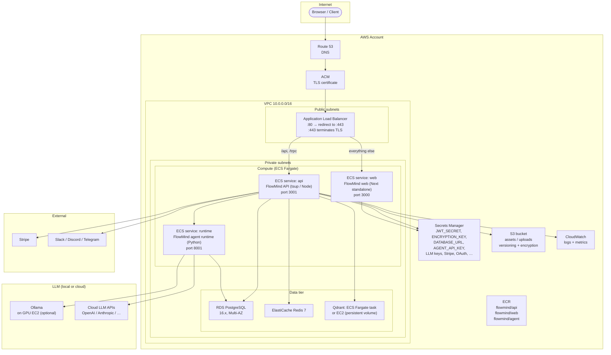

# AWS Deployment Architecture

This document recommends an AWS architecture grounded in FlowMind's actual stack. Nothing described here has been implemented; it is a design recommendation based on the production artifacts that exist today (Dockerfiles, compose files, k8s manifests) and the infra patterns the application expects.

When adapting these recommendations, treat the environment variables documented in [environment.md](./environment.md) as the contract between infrastructure and application.

---

## Architecture overview



---

## 1. Compute — ECS Fargate

FlowMind's web and API are stateless HTTP servers behind a load balancer: the API is a tsup-bundled Node process (`apps/api/dist/index.js`); the web is a Next.js standalone server (`apps/web/server.js`). Fargate is the right choice — no cluster management, per-task billing, and horizontal scaling with no OS-level coordination.

### Services to run

| Service | Port | Dockerfile target | Notes |
|---------|------|-------------------|-------|
| `flowmind-web` | 3000 | `web-runner` | Stateless. Scale to multiple tasks behind the ALB. |
| `flowmind-api` | 3001 | `api` | Stateless (Postgres/Redis/Qdrant are external). Scale horizontally. |
| `flowmind-agent-runtime` | 8001 | `packages/agent-runtime/Dockerfile` | See below for the Ollama question. |
| `flowmind-qdrant` (if self-hosted) | 6333 / 6334 | `qdrant/qdrant:latest` | Needs persistent storage — see Qdrant section. |

### Why Fargate over EKS

FlowMind does not need Kubernetes-level orchestration for the first deployment. Fargate gives you the per-task elastic scaling, health-check-driven replacement, and zero-node-management cost that a two-to-four-service deployment needs. Migrate to EKS only when you need HPA-style scaling granularity, cron-based task scaling, or multi-stage canary deployments as team scale demands.

### Ollama — local LLM on GPU EC2 (optional)

Ollama runs `localhost:11434` on the runtime; on AWS there is no way to get a shared `localhost` in a network between Fargate and another service. Two options:

**Option A — Cloud LLM keys only (recommended starting point).** Drop Ollama entirely; pass cloud LLM keys (`OPENAI_API_KEY`, `ANTHROPIC_API_KEY`, etc.) via Secrets Manager. No GPU instance, no GPU cost. FlowMind routes through `OLLAMA_URL` or cloud provider keys depending on model configuration.

**Option B — Dedicated GPU EC2 instance for Ollama.** Run Ollama on a `g5.*` (or `g4dn.*`) EC2 instance in the same VPC, and set `OLLAMA_HOST=http://<ec2-private-ip>:11434` in the runtime's environment.

Trade-offs:

| Factor | Cloud LLM (A) | Ollama on GPU EC2 (B) |
|--------|--------------|-----------------------|
| GPU cost | $0 | ~$0.53/hr on g5.xlarge (A10); $0.19/hr on g4dn.medium (T4) |
| Inference latency | Network round-trip + provider queue | Local GPU — fastest |
| Model flexibility | Depends on provider; may not have your specific model | Any GGUF you pull |
| Operational burden | Lowest — key rotation only | Must manage GPU instance, AMI, model updates |
| Cost at 100k+ requests/day | Predictable per-request | Cheaper if GPU is saturated; idle GPU is waste |

Start with (A); switch to (B) only when model privacy or latency requirements demand it and GPU utilization is high enough to justify the bill.

---

## 2. Database — Amazon RDS PostgreSQL

FlowMind uses PostgreSQL 16 (`postgres:16-alpine` in compose/k8s; Prisma in `packages/db`). Use Amazon RDS for managed provisioning, automated backups, point-in-time recovery, and minor-version patching without downtime.

### Configuration

| Setting | Value |
|---------|-------|
| Engine | PostgreSQL 16 |
| Instance class | `db.t4g.medium` (2 vCPU, 4 GiB) to start; `db.r6g.large` for higher throughput |
| Multi-AZ | Yes for production |
| Storage | 20–100 GiB gp3 (scale up as context/pipeline data grows) |
| Automated backups | Enabled; 7-day retention minimum; enable PITR for same-day recovery |
| Port | 5432 (internal) |
| Subnet group | Private subnets only — no public endpoint |
| Authentication | IAM database auth OR password auth — never password + public |

### `DATABASE_URL`

```
postgresql://flowmind:<your-strong-secret>@flowmind-db.xxxx.us-east-1.rds.amazonaws.com:5432/flowmind
```

Store this in Secrets Manager and inject into the ECS task definition via the container secret mechanism.

> **5432 vs 5433.** The example manifests and compose files all use `5432` (the Postgres default). The local dev box may run on `5433`. This is a connection-string detail; RDS uses `5432` internally. Use `5432` for RDS.

### Schema migrations

Run `pnpm db:migrate` as a one-shot ECS task (or an init container) on each deploy. Do **not** run migrations inside the long-running api task. Example:

```
aws ecs run-task --cluster flowmind --task-definition flowmind-api-migrate \
  --network-configuration subnets=privateSubnetId,securityGroups=sg-xxx \
  --overrides '...command=["pnpm","db:migrate"]'
```

---

## 3. Cache — Amazon ElastiCache Redis

Redis backs FlowMind's rate limiting and SSO state (`REDIS_URL`). Use ElastiCache (Redis 7) to avoid managing Redis yourself.

### Configuration

| Setting | Value |
|---------|-------|
| Engine | Redis 7.x (compatible) |
| Node type | `cache.t4g.micro` to start; `cache.t4g.small` for rate-limit-heavy traffic |
| Cluster mode | Not required initially; enable later for horizontal scaling |
| Auth | AUTH enabled — use a generated token |
| Subnet group | Private subnets only |
| Security group | Allow TCP 6379 from the ECS task security group only |

### `REDIS_URL`

```
redis://default:<your-strong-secret>@flowmind-cache.xxxx.0001.use1.cache.amazonaws.com:6379
```

Store in Secrets Manager, inject via ECS.

### Why Redis matters more now

Redis was previously treated as ephemeral local dev infra. Since Track 2, rate-limit counters and SSO session state are Redis-backed and durable. A Redis outage now causes auth failures and rate-limit regressions. Treat ElastiCache as a real production dependency.

---

## 4. Vector database — Qdrant

FlowMind uses Qdrant for vector storage (`flowmind_contexts` collection) and Ollama embeddings. There is no fully managed Qdrant service on AWS with first-class integration; you have two options.

### Option A — Qdrant on ECS Fargate (recommended)

Run the official `qdrant/qdrant` image as an ECS Fargate task with an EFS mount for persistence.

- Container port: 6333 (REST), 6334 (gRPC)
- Volume: EFS file system mounted at `/qdrant/storage` — persistent across task restarts
- CPU/memory: start with 0.5 vCPU / 1 GiB; scale for larger collections
- Backups: snapshot the EFS volume or call the Qdrant snapshot API (`POST /snapshots`) and archive to S3

`QDRANT_URL` for in-VPC traffic:

```
http://flowmind-qdrant.flowmind.local:6333
```

### Option B — EC2 with EBS

If Qdrant performance requirements exceed Fargate, run it on a `m6i.large` or `r6i.large` EC2 instance in a private subnet with an EBS volume. This is more work but gives you direct control over I/O and Qdrant configuration.

> Start with Option A. Move to Option B only when collection sizes or query throughput demand it.

---

## 5. Object storage — S3

FlowMind's fileIo / assets layer stores uploaded files. The root `.env.example` documents `S3_ENDPOINT`, `S3_ACCESS_KEY`, `S3_SECRET_KEY`, and a bucket reference.

### Recommended configuration

| Setting | Value |
|---------|-------|
| Bucket name | `flowmind-assets-<account-id>-<region>` |
| Versioning | Enabled (recover accidentally overwritten files) |
| Server-side encryption | AES-256 (S3-managed) or KMS |
| Lifecycle | Archive to Glacier after 90–180 days; delete incomplete multipart uploads after 7 days |
| Public access | Blocked |

### IAM roles over static keys

On AWS, the ECS task role with an attached IAM policy is the preferred way to grant S3 access. Do not bake `S3_ACCESS_KEY` / `S3_SECRET_KEY` into images or Secrets Manager for the primary account — use an IAM policy on the task role:

```json
{
  "Effect": "Allow",
  "Action": ["s3:GetObject", "s3:PutObject", "s3:DeleteObject"],
  "Resource": "arn:aws:s3:::flowmind-assets-*/*"
}
```

If you need a non-IAM S3 endpoint (e.g. for the Ollama proxy or local testing), use `S3_ENDPOINT` with the access keys in Secrets Manager.

---

## 6. Networking — VPC and ALB

### VPC layout

| Subnet | CIDR | Purpose |
|--------|------|---------|
| Public | 10.0.1.0/24, 10.0.2.0/24 | ALB, NAT gateway |
| Private | 10.0.10.0/24, 10.0.11.0/24 | ECS tasks, RDS, ElastiCache, Qdrant |

### ALB routing rules

| Path | Target | Port |
|------|--------|------|
| `/api/*` | flowmind-api | 3001 |
| `/trpc/*` | flowmind-api | 3001 |
| `/*` (default) | flowmind-web | 3000 |

Health check endpoints (for ALB target groups):

- Web: `GET /` on port `3000`
- API: `GET /health` on port `3001`

### TLS termination

ALB terminates TLS (ACM certificate). Redirect HTTP → HTTPS. The ECS tasks receive plain HTTP traffic on the private network; ALB passes `X-Forwarded-*` headers.

---

## 7. Secrets management — AWS Secrets Manager

Every secret in [environment.md](./environment.md) that has `Secret: Y` must live in Secrets Manager (or SSM SecureString), never in image layers or compose files.

### What to store

| Secret | AWS Secrets Manager key name (suggested) |
|--------|------------------------------------------|
| `DATABASE_URL` | `flowmind/prod/database-url` |
| `JWT_SECRET` | `flowmind/prod/jwt-secret` |
| `ENCRYPTION_KEY` | `flowmind/prod/encryption-key` |
| `AGENT_API_KEY` | `flowmind/prod/agent-api-key` |
| `INTERNAL_API_KEY` | `flowmind/prod/internal-api-key` |
| `REDIS_URL` | `flowmind/prod/redis-url` (contains AUTH token) |
| `STRIPE_SECRET_KEY` | `flowmind/prod/stripe-secret-key` |
| `STRIPE_WEBHOOK_SECRET` | `flowmind/prod/stripe-webhook-secret` |
| `OPENAI_API_KEY` | `flowmind/prod/llm/openai` |
| `ANTHROPIC_API_KEY` | `flowmind/prod/llm/anthropic` |
| `GOOGLE_AI_API_KEY` | `flowmind/prod/llm/google` |
| `GITHUB_CLIENT_SECRET` | `flowmind/prod/oauth/github` |
| `GOOGLE_CLIENT_SECRET` | `flowmind/prod/oauth/google` |
| `SMTP_PASS` | `flowmind/prod/smtp` |
| Channel tokens / webhook secrets | `flowmind/prod/channels/<name>` |

### Injection pattern (ECS)

Reference secrets directly in the ECS task definition using the `secrets` array (not the `environment` array):

```json
{
  "secrets": [
    { "name": "JWT_SECRET", "valueFrom": "arn:aws:secretsmanager:us-east-1:123456789012:secret:flowmind/prod/jwt-secret:ABC123::" }
  ]
}
```

The application reads `JWT_SECRET` (and every other env var) as a normal process environment variable at startup; no code change is needed — this is how the API, web, and runtime already consume configuration.

---

## 8. Domain, HTTPS, Route 53

| Step | Detail |
|------|--------|
| Domain | Purchase or transfer to Route 53 (or add NS records if using another registrar). |
| Certificate | Request a public certificate in ACM for `flowmind.example.com` + `*.flowmind.example.com`. ACM validates via DNS (Route 53) automatically. |
| ALB listener | Add a `:443` listener with the ACM cert. Add a `:80` listener that redirects to `:443`. |
| DNS record | `A` (alias) → ALB. For apex (`flowmind.example.com`) use ALIAS; for subdomains use CNAME (alias if Route 53). |

---

## 9. Logging and monitoring

### CloudWatch Logs

ECS tasks emit to CloudWatch Logs. Create a log group per service:

```
/ecs/flowmind-api
/ecs/flowmind-web
/ecs/flowmind-agent-runtime
```

Set `LOG_LEVEL=info` (or `debug` during triage) and forward key errors to Sentry.

### Sentry

Set `SENTRY_DSN` (and optionally `SENTRY_TRACES_SAMPLE_RATE=0.1`) for both the API and web. Sentry gives you error-grouped dashboards, release tracking, and transaction-level tracing independent of your logging backend.

### Prometheus / `/metrics`

The API exposes `GET /metrics` (requires `AGENT_API_KEY` or `INTERNAL_API_KEY` to access in production). To scrape:

- Option A: Deploy a Prometheus sidecar or a standalone Prometheus in the same VPC and configure it to scrape the API task on port `3001/metrics`.
- Option B: Use CloudWatch Embedded Metric Format if you prefer a fully AWS-native approach.

### Uptime and alerting

Set up health-check-based alarms:

| Alarm | Source | Threshold |
|-------|--------|-----------|
| API 5xx rate | ALB access logs → CloudWatch | > 1% of requests over 5 minutes |
| API unreachable | `/health` probe (external or CloudWatch Synthetics) | 2 consecutive failures |
| RDS CPU | CloudWatch | > 80% sustained 10 min |
| RDS storage | CloudWatch | > 80% utilization |
| ElastiCache memory | CloudWatch | > 75% utilization |
| Qdrant disk | CloudWatch (custom metric or agent) | > 80% utilization |
| Stripe webhook failure | Stripe dashboard + Sentry | Any sustained failure |

---

## 10. Backups

| Service | Backup method | Recovery point |
|---------|---------------|----------------|
| RDS PostgreSQL | Automated backups (7-day default) + manual snapshots | PITR (up to 7 days) |
| ElastiCache Redis | Daily snapshots + automatic failover | Last snapshot + failover |
| Qdrant (EFS or EBS) | EBS snapshots every 6 hours OR `POST /snapshots` API → archive to S3 | Point-in-time (EBS) or snapshot time |
| S3 | Versioning (already recommended) | Any version; cross-region replication optional |

Run a manual restore test every quarter into a scratch environment.

---

## 11. Scaling

FlowMind's async pipeline and run-recovery design means the API can scale horizontally without coordination, as long as:

- The database (RDS) has enough connection capacity and IOPS
- Redis is shared (ElastiCache, not in-process)
- Qdrant is shared (single Qdrant deployment, not local)

### What scales horizontally

- **API tasks:** Increase the desired count behind the ALB. State is in Postgres/Redis/Qdrant; the API is fully stateless between requests.
- **Web tasks:** Increase the desired count. The web is a static file server (Next standalone) with no server-side state.

### What does not scale trivially

- **Agent runtime:** The Python runtime connects to Ollama; if Ollama is on a single GPU instance, the runtime tasks share it. Scale the runtime up to the GPU's capacity; beyond that, either shard by model (separate Ollama endpoints) or move to a fully cloud-LLM path.

### RDS and ElastiCache sizing

| Service | Start with | Scale to |
|---------|-----------|---------|
| RDS | `db.t4g.medium` (2 vCPU, 4 GiB) | `db.r6g.large` (2 vCPU, 16 GiB) or Aurora Serverless v2 |
| ElastiCache | `cache.t4g.micro` | `cache.t4g.small` (2 GiB) or enable cluster mode |

---

## 12. CI/CD — GitHub Actions (recommended, not implemented)

No CI/CD pipeline exists today (no `.github/workflows`). This is the recommended pipeline.

### Pipeline stages

```
push to main / tag
    ↓
[1] Lint + type-check
    pnpm install → tsc --noEmit (apps/api, apps/web, shared packages)
    ↓
[2] Build images
    docker build --target api     → flowmind/api:<tag>
    docker build --target web-runner → flowmind/web:<tag>
    (agent-runtime) docker build packages/agent-runtime → flowmind/agent:<tag>
    ↓
[3] Push to ECR
    aws ecr get-login-password | docker login
    docker push flowmind/api:<tag>
    docker push flowmind/web:<tag>
    docker push flowmind/agent:<tag>
    ↓
[4] Deploy to ECS
    aws ecs update-service --cluster flowmind --service flowmind-api \
      --force-new-deployment
    (repeat for web and runtime)
    ↓
[5] Run database migrations (one-shot ECS task)
    aws ecs run-task ... command=["pnpm","db:migrate"]
    ↓
[6] Health check gate
    curl -f https://flowmind.example.com/health || rollback
```

Use ECR lifecycle policies to expire old images. Tag images with the git SHA or a semver tag.

---

## 13. Security checklist (AWS-specific)

- [ ] No secret is baked into a Docker image or committed to git — every `Secret: Y` variable in [environment.md](./environment.md) is in Secrets Manager.
- [ ] RDS is in a private subnet with no public endpoint; security group allows TCP 5432 from the ECS task security group only.
- [ ] ElastiCache is in a private subnet with AUTH enabled; security group allows TCP 6379 from the ECS task security group only.
- [ ] Qdrant is in a private subnet; not exposed to the internet.
- [ ] ALB security group allows TCP 80/443 from the internet; health checks are allowed from the ALB IP range.
- [ ] ECS task roles follow least-privilege: only the specific S3/RDS/ElastiCache/Secrets Manager actions each service needs.
- [ ] ACM certificate auto-renews (Route 53 DNS validation handles this automatically).
- [ ] AWS WAF on the ALB blocks obvious abuse (SQL injection, XSS, rate-limiting) before it reaches the application.
- [ ] S3 bucket blocks all public access; uses SSE-KMS; versioning is enabled.
- [ ] CloudTrail is enabled for the account for audit.

---

## 14. Production config (environment variables)

Copy the minimum set from [environment.md](./environment.md) (the "Minimum viable production set" section), with every value sourced from Secrets Manager or the ECS task definition:

```
NODE_ENV=production
DATABASE_URL=arn:aws:secretsmanager:...
JWT_SECRET=arn:aws:secretsmanager:...
ENCRYPTION_KEY=arn:aws:secretsmanager:...
REDIS_URL=arn:aws:secretsmanager:...
QDRANT_URL=http://flowmind-qdrant.flowmind.local:6333
APP_URL=https://flowmind.example.com
API_URL=https://flowmind.example.com
AGENT_RUNTIME_URL=http://flowmind-agent-runtime:8001
AGENT_API_KEY=arn:aws:secretsmanager:...
INTERNAL_API_KEY=arn:aws:secretsmanager:...
OLLAMA_URL=  (omitted if using cloud LLM keys only)
OPENAI_API_KEY=arn:aws:secretsmanager:...
# ... other provider keys as needed
STRIPE_SECRET_KEY=arn:aws:secretsmanager:...
STRIPE_WEBHOOK_SECRET=arn:aws:secretsmanager:...
ALLOW_PRIVATE_NETWORK_HTTP=false
PIPELINE_DB_ALLOW_WRITE=false
ALLOW_UNVERIFIED_WEBHOOKS=false
ENABLE_DEV_BILLING_MOCK= (never set)
LOG_LEVEL=info
SENTRY_DSN=arn:aws:secretsmanager:...
```

No dev fallbacks. No empty strings for secrets. No `change-me-in-production`.

---

## 15. Migration: localhost → AWS

Step-by-step:

1. **Confirm images build.** `docker build --target api -t flowmind/api:local .` and `docker build --target web-runner -t flowmind/web:local .`. Boot them with `docker compose -f deploy/docker-compose.yml up` and hit `/health` — must return `200` with `database:true` and `agentRuntime:true`.

2. **Create ECR repositories** for each image: `flowmind/api`, `flowmind/web`, `flowmind/agent`.

3. **Create the VPC**, public/private subnets, NAT gateway, and security groups. Create an RDS PostgreSQL instance and an ElastiCache Redis cluster in the private subnets.

4. **Create Secrets Manager entries** for every `Secret: Y` variable. Generate real secrets (JWT_SECRET, ENCRYPTION_KEY, AGENT_API_KEY, etc.).

5. **Run `pnpm db:migrate`** against the new RDS instance (you can do this from a bastion, or run it as a one-off ECS task).

6. **Push images to ECR.** Tag with a version (e.g. `v0.1.0` or git SHA).

7. **Create ECS task definitions** for web, api, and runtime. Reference Secrets Manager for all secrets; set the non-secret environment variables in the `environment` block.

8. **Create ECS services** behind an ALB. Configure the ALB target groups with the health-check endpoints (`/health:3001` for API, `/:3000` for web).

9. **Request an ACM certificate** and add a Route 53 alias record pointing at the ALB.

10. **Smoke test.** Hit the public HTTPS URL, register a user, run a pipeline, confirm LLM inference works, verify metrics endpoint returns data.

11. **Set up CloudWatch alarms** for 5xx, RDS CPU, ElastiCache memory, and health-check failures.

12. **Take a backup.** Trigger an RDS snapshot and verify you can restore it.

---

## Cost/scale note

The single largest operational cost question is the Ollama local-LLM path:

- **Zero GPU cost:** use only cloud LLM keys (OpenAI, Anthropic, etc.) — no GPU EC2 needed, no GPU bills.
- **GPU cost floor:** a `g5.xlarge` (A10, 24 GiB VRAM) is ~$0.80/hr on-demand; a `g4dn.medium` (T4, 16 GiB) is ~$0.52/hr. Use a reserved instance or spot for a 30–60% reduction.
- **Break-even:** at roughly 50k–100k inference requests/day, a GPU instance may become cheaper than per-token cloud pricing, depending on the model and token count per request. Below that, cloud LLM is almost always cheaper and simpler.

Start with cloud LLM keys. Move to GPU EC2 for Ollama only when you have a concrete model requirement (privacy, specific fine-tune, latency) or the GPU can be kept busy enough to justify the bill.

---

## Honesty note

This document is a **recommendation**, not a record of what has been deployed. No part of this architecture has been run against AWS. The facts are grounded in the application's real production artifacts (Dockerfiles, compose files, k8s manifests, environment variables), but the AWS services, VPC layout, IAM policies, and scaling thresholds are design suggestions. Adapt them to your actual traffic, budget, and compliance requirements.
