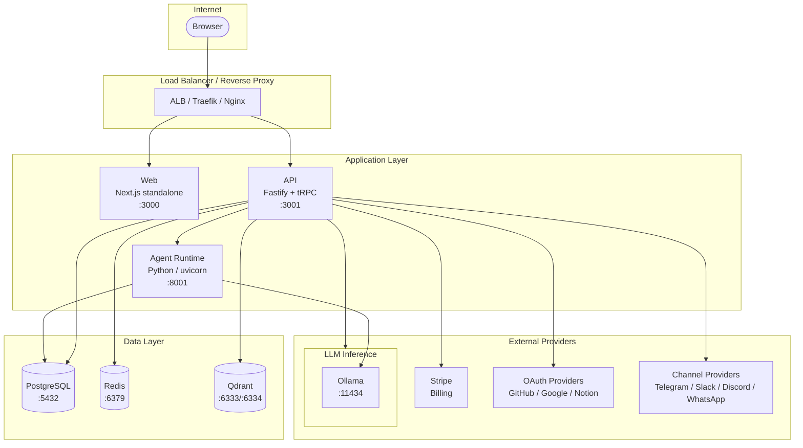

# Deployment Overview

## Current State (Honest Assessment)

FlowMind currently runs in **local dev mode** on the developer's workstation. The production build artifacts exist and have been validated locally -- the API boots healthy from a self-contained tsup bundle (`apps/api/dist/index.js` via `node dist/index.js`) and the web builds a Next.js standalone server (`.next/standalone`) that starts successfully -- but the application has never been deployed to a public internet endpoint.

**What works today:**

- API builds via tsup into a single CJS bundle; boots and passes health checks on localhost:3001
- Web builds via `next build` with `output: "standalone"`; boots on localhost:3000
- Python agent-runtime runs via uvicorn on localhost:8001
- Infrastructure runs as native binaries on Windows (Redis, Qdrant) because Docker/WSL2/Hyper-V is unavailable on the dev box (`HCS_E_HYPERV_NOT_INSTALLED`)

**What does not exist yet:**

- No CI/CD pipeline (no `.github/workflows` directory)
- No validated Docker images (Dockerfile targets are written but never built end-to-end)
- No deployed environment
- External integrations (Stripe billing, cloud LLM providers, OAuth SSO, channel providers like Telegram/Slack/Discord/WhatsApp) are unconfigured and untested against a live deployment
- No secrets management beyond `.env` files and k8s placeholder values

The grade is: **local production-verifiable, not yet public-internet production-ready.**

## Production Topology

## Deployment Paths Available

| Path | What It Provisions | Best For | Validation Status |
|------|-------------------|----------|-------------------|
| `pnpm dev` / dev launcher scripts | Local dev servers with hot reload | Day-to-day development | Working |
| `install.sh` | Full single-node Linux install: Node, Postgres, Redis, Qdrant, Ollama, systemd services, CLI link | Personal Linux workstation or small VPS | Unvalidated (never run end-to-end) |
| `deploy/docker-compose.yml` | All app services + Postgres in containers | Single-server Docker deployment | Unvalidated (images never built) |
| `infra/compose/local.yml` | Just Postgres, Redis, Qdrant, MinIO (no app) | Local dev infrastructure alongside `pnpm dev` | Used alongside dev mode |
| `infra/compose/production.yml` | App images + data services + Traefik reverse proxy | Single-server production with TLS | Unvalidated; port discrepancy on agent service |
| `infra/k8s/*.yaml` | Full Kubernetes deployment: namespace, deployments, services, ingress | Cluster deployment | Unvalidated; contains placeholder secrets |
| `deploy/*.service` | systemd unit files for API, web, runtime | Bare-metal Linux with systemd | Used by install.sh |
| `scripts/backup.sh` | PostgreSQL dump + Redis RDB + Qdrant snapshot + env archive | Backup automation | Depends on Docker containers running |

## Decision Guide

**"I want to develop locally"**
Use `pnpm dev` with native infrastructure started via `infra/scripts/start-native-infra.ps1` (Windows) or `infra/compose/local.yml` (Docker-capable systems).

**"I want to deploy FlowMind on a single Linux server"**
Run `install.sh`. It installs all dependencies, builds the application, and writes systemd unit files. Put a reverse proxy (Nginx/Caddy) in front for TLS. This is the fastest path to a working deployment.

**"I want to deploy with Docker on a single server"**
Use `deploy/docker-compose.yml`. Set `JWT_SECRET` and other required env vars. Build the images with `docker compose build`. Put Traefik or Nginx in front for TLS.

**"I want a multi-server or cloud deployment"**
Use the `infra/k8s/` manifests as a starting point, or use the production compose file. See [aws.md](./aws.md) for the recommended AWS architecture. Expect to adapt these manifests to your environment -- they contain placeholder secrets and have not been validated against a real cluster.

**"I want to back up a running deployment"**
Run `scripts/backup.sh`. It requires Docker containers named `flowmind-postgres-1`, `flowmind-redis-1`, and `flowmind-qdrant-1` (the default Docker Compose names).
