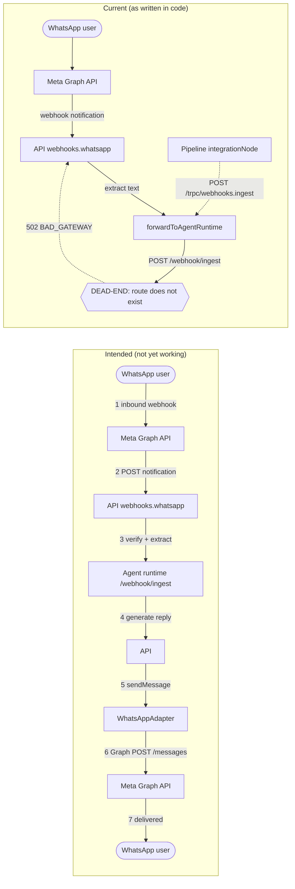

# WhatsApp Integration Overview

## Purpose

WhatsApp is intended to be a channel into the FlowMind platform: it lets external
users send messages to a FlowMind-hosted phone number and receive agent replies
back on WhatsApp, as well as let internal pipeline flows push responses to a
WhatsApp user. In short, it is a **receive + reply** channel, analogous to
Telegram or Slack.

The integration has two halves:

- **Inbound** — Meta posts a webhook notification when a user messages the
  number; FlowMind parses it and feeds it to the agent runtime / pipeline.
- **Outbound** — FlowMind sends a reply back through Meta's Graph API to the
  user's WhatsApp account.

See [architecture.md](./architecture.md) for the detailed component breakdown and
[workflow.md](./workflow.md) for the message flows.

## Current status (headline)

> **STUB-TO-REAL HYBRID, END-TO-END NON-FUNCTIONAL.**

Breaking it down honestly:

- **Outbound adapter is REAL but UNWIRED.** `WhatsAppAdapter.sendMessage` makes a
  genuine call to Meta's Graph API (`graph.facebook.com/{apiVersion}/{phoneNumberId}/messages`)
  and would send a message if invoked. However, the adapter is **never instantiated
  in application production code** — it exists only in tests. No code path in
  `apps/api` or anywhere else creates it or registers it with the `ChannelGateway`.

- **Inbound webhook forward is a DEAD-END.** When Meta posts an inbound message,
  the API router `webhooks.whatsapp` extracts the text and forwards it to
  `AGENT_RUNTIME_URL/webhook/ingest`. **That route does not exist** in the Python
  agent runtime, so inbound delivery fails with `BAD_GATEWAY` / 502 every time.

- **No Meta verify GET handshake.** Meta requires a GET challenge-response
  verification before it will deliver webhooks. No such route exists anywhere.

- **Normalizer is vestigial.** `normalizeWhatsApp` expects Baileys-shaped
  payloads (`key.remoteJid`, `chatId`, `mediaKey`, ...) that no producer emits;
  the Graph envelope shape is a different schema entirely.

- **No message templates, no persistence.** There are no WhatsApp-specific
  message templates, and WhatsApp messages are not persisted as first-class
  records anywhere.

The result: nothing in the WhatsApp path is currently reachable end-to-end.

## Intended flow vs. current flow

The top loop shows what the integration is supposed to do. The bottom path shows
the single live code path today, which terminates at a non-existent route.
