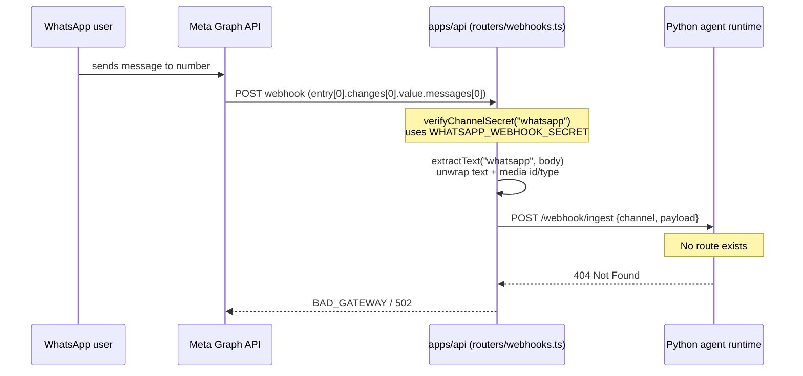
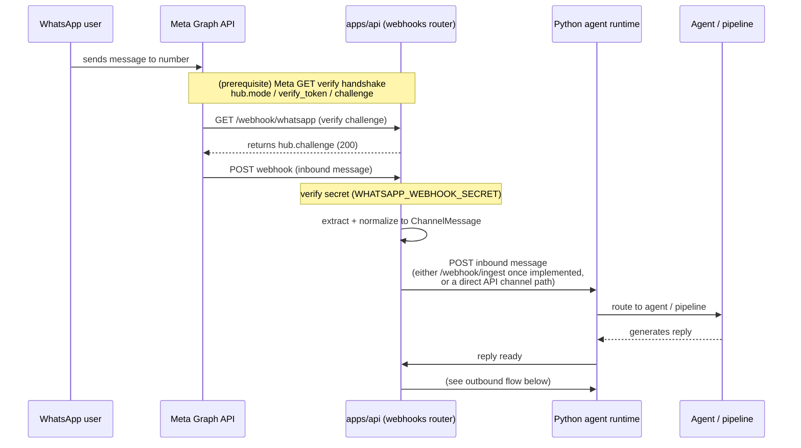
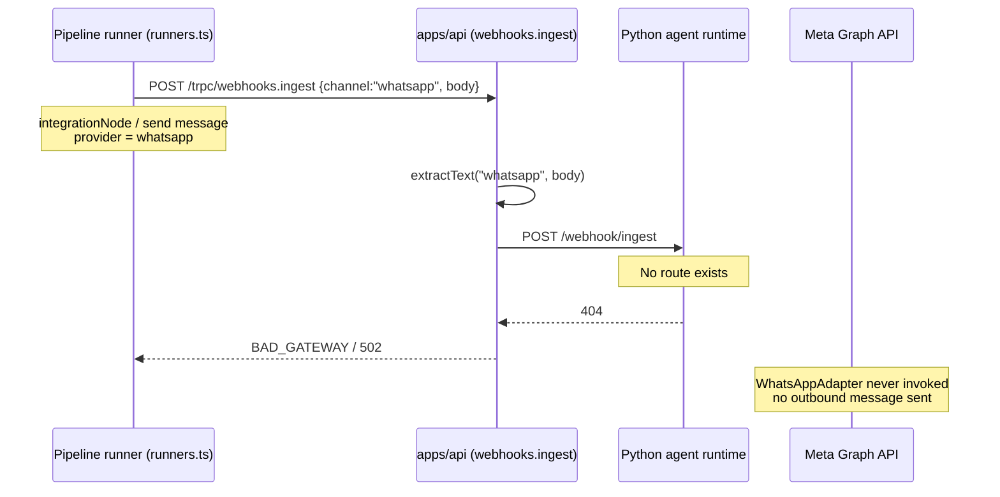
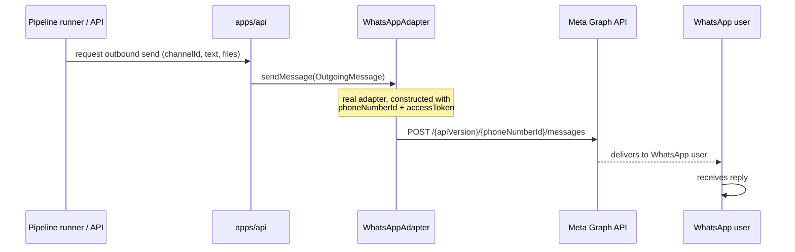

# WhatsApp Workflows

This document describes the two WhatsApp workflows — **inbound** (user message
into FlowMind) and **outbound** (FlowMind reply to the user) — both as they
**exist in code today** (with the dead-end annotated) and as they **should** work
once fixed.

Related docs: [overview.md](./overview.md), [architecture.md](./architecture.md),
[integration.md](./integration.md).

---

## Inbound workflow (user → FlowMind)

### As it exists today

**Key facts about the current inbound path:**

- The API receives the raw Meta notification and validates the secret
  (dev bypass unless `WHATSAPP_WEBHOOK_SECRET`/`WEBHOOK_SECRET` set and prod/enforced).
- `extractText` correctly unwraps the Graph envelope, including media id/type.
- The path then **dead-ends**: it forwards to `AGENT_RUNTIME_URL/webhook/ingest`,
  which does not exist. Result is a 502 for every inbound WhatsApp message.
- There is **no Meta verify GET handshake**, so Meta would not deliver the
  webhook at all even if the forward worked.

### How it should work once fixed

The essential difference: after extraction, the message must reach a real handler
instead of a non-existent route, and a Meta GET verification endpoint must sit in
front so Meta delivers at all.

**What is missing to make inbound work:**

- The Meta GET verification handshake route.
- A real destination for the extracted message (implement `/webhook/ingest` in
  the Python runtime, or route inbound through the API channel layer directly,
  or call `WhatsAppAdapter.handleUpdate` + a response path — see
  [integration.md](./integration.md#recommended-fix-path)).
- Reconcile the payload shape between `extractText`/`handleUpdate` (Graph) and
  `normalizeWhatsApp` (Baileys) so there is one consistent normalization.

---

## Outbound workflow (FlowMind → user)

### As it exists today (via pipeline)

**Key facts:**

- The pipeline can target `whatsapp` in its `integrationNode` / send runners.
- It routes through the generic `webhooks.ingest` route (the same dead-end as
  inbound), so the send fails with 502.
- Crucially, **`WhatsAppAdapter.sendMessage` is never called.** There is no code
  path from the pipeline or the API to the Graph API outbound call.

### How it should work once fixed

The outbound fix is comparatively simple: **wire and call `WhatsAppAdapter` with
real credentials.** The adapter's `sendMessage` already implements the Graph API
POST correctly; it just needs to be instantiated, registered with the
`ChannelGateway`, and reached from the send path.

**What is missing to make outbound work:**

- Instantiate `WhatsAppAdapter` with `WHATSAPP_PHONE_NUMBER_ID` +
  `WHATSAPP_ACCESS_TOKEN` and register it with the `ChannelGateway`.
- Route pipeline/API sends to the adapter (instead of the dead-end `ingest`).
- Decide whether outbound replies ride through the agent runtime or straight
  from the API channel layer.
