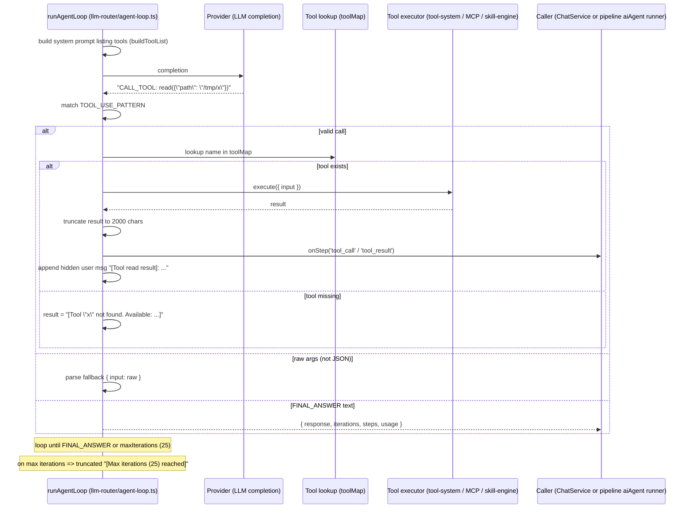

# Agent Tool Workflow

How an agent (chat or pipeline `aiAgent`) decides to call a tool and what happens with the result.

## Sequence

## Where tools come from

- Chat (`ChatService.buildChatTools`): `toolRegistry` (tool-system) filtered to `NON_DESTRUCTIVE_TOOLS` (`read`, `grep`, `glob`, `webfetch`, `websearch`, `http_request`, `todowrite`) + MCP tools from `listMcpAgentToolsForUser` (`apps/api/src/services/mcp-client.ts`). So a chat agent can read files, search, fetch web pages, and call any registered MCP server tool, but cannot write files or run arbitrary code.
- Pipeline `aiAgent` runners (`runners.ts`): wrap an `LLMProvider` with `wrapLLMAsProvider` and supply 4 pipeline-local tools — `webSearch`, `calculator`, `currentTime`, and `readFile` (the last is a simulated stub that returns a placeholder).

## The protocol

- The system prompt instructs the model to answer **only** with:
  - `CALL_TOOL: name(jsonArgs)` — single regex capture, one tool per turn
  - `FINAL_ANSWER: text` — the loop ends and returns `response`
- Tool results are appended as a hidden user message with a `[Tool <name> result]:` prefix, so the model sees the outcome and picks the next action.
- Both `TOOL_USE_PATTERN` and `FINAL_ANSWER_PATTERN` are anchored `^...$` regexes in `packages/llm-router/src/agent-loop.ts`.

## Result handling

- `AgentLoopResult`: `{ response, iterations, steps, usage }` — the caller persists a `Message` (chat) or node output (pipeline).
- Steps are emitted through `onStep`: `thought`, `tool_call`, `tool_result`.
- Cloud providers that natively support tool calling are used in plain-completion mode here (single CALL_TOOL text protocol is provider-agnostic); no provider-specific tool-calling API is used by the loop.

## Failure / edge cases

- Malformed JSON args: fallback `{ input: raw }` (permissive).
- Unknown tool: a "not found" message returns to the model.
- Provider failure: loop throws `[LLM error: ...]` (aborts the turn).
- Max iterations: truncated final answer, loop ends.
- No AbortSignal wiring: client stop does not cancel the provider call.