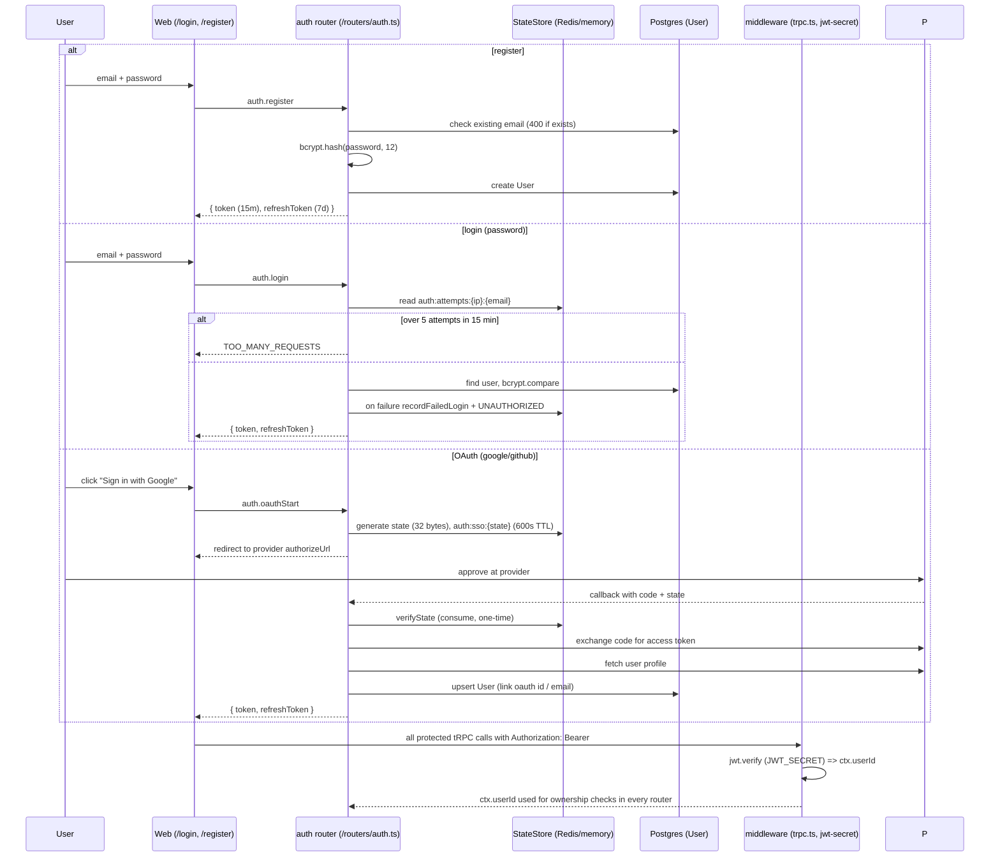

# Auth Workflow

How a user signs in (password or OAuth) and how identity flows into every tRPC route.

## Sequence

## Identity resolution

- `auth.login`/`register`/`oauthCallback` return `{ user, token, refreshToken }`.
- `token` is a 15-minute JWT signed with `JWT_SECRET` (from `apps/api/src/lib/jwt-secret.ts`; a random secret is generated at runtime when none is configured — restart invalidates tokens).
- `protect` middleware in `apps/api/src/middleware/trpc.ts` verifies the Bearer token and sets `ctx.userId`. All routers scope queries with `where: { userId: ctx.userId ?? undefined }`; ownership mismatches return 404 (not 403) to avoid leaking existence.
- SSE endpoints (`/api/chat/stream`, `/api/pipeline/stream`) resolve the same JWT from the Authorization header (`?token=` allowed outside production).

## Rate limiting / SSO state

- Login attempts: `auth:attempts:{ip}:{email}` in `getStateStore()` (Redis when configured, in-memory fallback): 5 attempts per 15-minute window.
- SSO state: `auth:sso:{state}` with 600s TTL, single-use (deleted on verify), provider-bound.
- OAuth clients: Google and GitHub only (`SSO_CLIENTS` in `apps/api/src/routers/auth.ts`).

## Refresh / logout / MFA / SAML

- `auth.refresh`: validates the refresh token and issues a new access token (no rotation).
- `auth.logout`: deletes the current session row; does **not** blacklist the refresh token.
- `auth.mfa.setup/verify` and `auth.saml.metadata/assert`: declared in the router surface but not wired to a real MFA/SAML stack — attempting them hits a stub.

## Failure / edge cases

- Unknown email + wrong password both yield `UNAUTHORIZED` (no user enumeration).
- OAuth callback with an invalid/expired/reused state is rejected (state is consumed on first verification).
- Long chat streams can outlive the 15-minute access token; the client refreshes and reconnects.
- Password reset exists via `sendMail` (`apps/api/src/lib/mailer.ts`) but only when SMTP is configured.