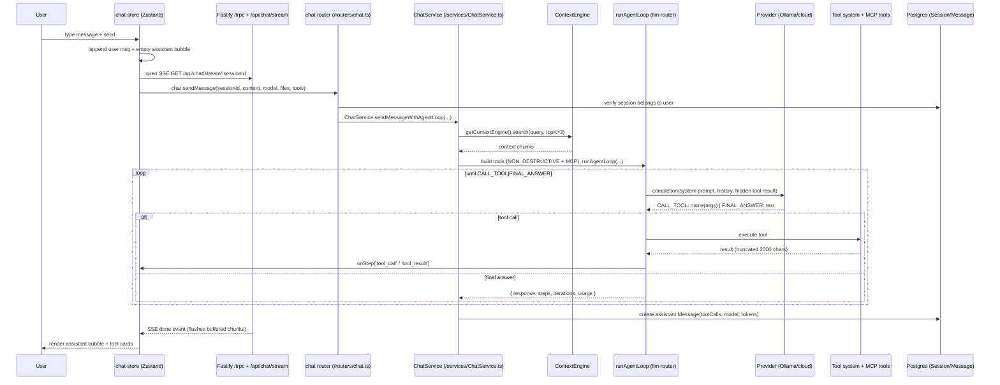

# Chat Workflow

How a user sends a message and receives a streamed, tool-using agent reply.

## Sequence

## Request entry

- The chat UI (`apps/web/src/app/chat/page.tsx`) uses `useChatStore()` from `apps/web/src/hooks/chat-store.ts`.
- `sendMessage` opens the SSE stream first (`${API_URL}/api/chat/stream/${sessionId}` with a Bearer token), then fires tRPC `chat.sendMessage` concurrently (`Promise.allSettled`).
- The SSE endpoint (`apps/api/src/index.ts`, line 193) resolves the user from the Authorization header, verifies the session belongs to that user, then subscribes to the session's `BufferedEmitter` and replays any buffered events.

## Server side

- `chat.sendMessage` (`apps/api/src/routers/chat.ts`):
  1. Loads the `Session`; rejects if `session.userId !== ctx.userId`.
  2. Creates or reuses a `BufferedEmitter` for the session (backed by `session-emitters.ts`).
  3. Calls `ChatService.sendMessageWithAgentLoop` (`apps/api/src/services/ChatService.ts`).
- `ChatService`:
  1. Enriches the message with up to 3 context chunks (`ContextEngine.search`) so the model has grounding.
  2. Selects a provider: `openai` → `anthropic` → `ollama`, then fallback to the first configured provider (from `packages/llm-router/src/engine.ts`).
  3. Resolves a model (Ollama default or a cloud default in `CLOUD_DEFAULT_MODELS`).
  4. Builds the tool surface via `buildChatTools`: the global `toolRegistry` filtered to `NON_DESTRUCTIVE_TOOLS` (`read`, `grep`, `glob`, `webfetch`, `websearch`, `http_request`, `todowrite`) plus MCP tools from `listMcpAgentToolsForUser` (`apps/api/src/services/mcp-client.ts`).
- `runAgentLoop` (`packages/llm-router/src/agent-loop.ts`):
  - Protocols: `CALL_TOOL: name(jsonArgs)` and `FINAL_ANSWER: text` (regexes `TOOL_USE_PATTERN`, `FINAL_ANSWER_PATTERN`).
  - Each tool result is appended as a hidden user message; loop caps at `maxIterations` (25).
  - `onStep` emits `thought` / `tool_call` / `tool_result` events, which the SSE stream forwards.

## Persistence

- `Message` is inserted with `role: "assistant"`, `content`, `toolCalls`, `model`, `provider`, `tokensIn`/`tokensOut`, `duration`. `Message.toolResults` is defined in the schema but currently not populated by this path.
- Session `title` and `summary` may be updated by the streamed result.

## Client rendering

- `chat-store.ts` consumes the SSE `events`; it buffers incomplete `\n\n`-split chunks and flushes them on each complete event (the "trailing-buffer" fix).
- Errors come back as SSE `error` events and render as an error bubble (`message.error`).
- A 90-second `MAX_STREAM_DURATION` watchdog aborts the fetch if the stream stalls.

## Failure / dead-end paths

- If `runAgentLoop` throws and context-tool enrichment succeeded, `sendMessageWithAgentLoop` falls back to `callAgentRuntimeWithRetry` → Python agent runtime `POST /chat/send` via `CircuitBreaker(3, 30s)`. The legacy runtime path is secondary.
- `stopStreaming()` aborts the fetch, but the provider call inside `runAgentLoop` has no AbortSignal from the client — the server may finish the call and write the message anyway.
- Cloud providers are wired but not all verified in this deployment; with only Ollama running, selection collapses to Ollama (verified path).