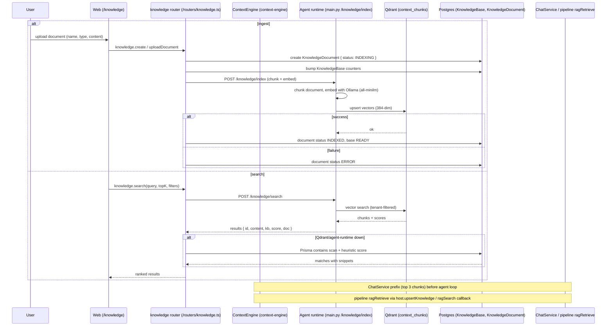

# Knowledge Ingest Workflow

How a user uploads a document and how chat/pipelines retrieve it with RAG.

## Sequence

## Two indexing paths (important)

- **`knowledge.*` router path** (the one above): delegates to the Python agent runtime (`POST /knowledge/index`, `/knowledge/search`, `/knowledge/delete` in `packages/agent-runtime/src/main.py`, lines ~224/247/284). The agent runtime owns chunking/embedding and writes into its own store.
- **`ContextEngine` path** (`packages/context-engine/src/index.ts`): `index`/`search`/`delete` operate on the `context_chunks` Qdrant collection with cosine similarity and a `memoryMode` fallback (in-process cosine). Used by `ChatService.getContextEngine()` and by `host.upsertKnowledge` / pipeline `ragRetrieve`.

These two paths can diverge (different collections/namespaces if configuration differs), which is a real known issue.

## Chunking / embedding

- Embeddings: Ollama `all-minilm` (default) → 384-dimensional vectors; `KnowledgeBase.model` defaults to `nomic-embed-text`.
- Each document is chunked before indexing; chunks are stored as vector rows keyed by `userId` (+ optional `groupId`).
- `totalSize` is tracked (BigInt) and used by billing usage metrics; `totalChunks` is not updated by the current path.

## Query path details

- `knowledge.search` calls the agent runtime `/knowledge/search`; the Python return includes chunk text, kb, score, and doc info.
- Failure fallback (runtime unreachable): a Prisma `contains` scan of the user's documents, scored 0.9 exact / 0.7 substring, with `extractSnippet` windowing. This is heuristic and unembedded.
- Chat augmentation: `ChatService` fetches `topK=3` context chunks and prefixes them to the user message before `runAgentLoop`.
- Pipeline RAG: `ragRetrieve` runner calls the injected `ragSearch` callback (wired in `executeRunBackground` with group scoping for group pipelines).

## Persistence

- `KnowledgeBase` (status READY/INDEXING/ERROR, totalDocs/totalChunks/totalSize, hostGroupId for group knowledge).
- `KnowledgeDocument` (type, size, chunks, status, content) — cascades with the base.
- `Memory` model (episodic/semantic/procedural) exists and is surfaced by `context.getMemories`, but is not written by the ingest path above.

## Failure / dead-ends

- Agent runtime down → indexing fails (`status: ERROR`); search falls back to unembedded DB scan.
- Content-less document: `uploadDocument` still creates the base/document but does not index (no content to embed).
- Qdrant down at boot → `ContextEngine` flips to in-process memory mode; data is lost on restart.