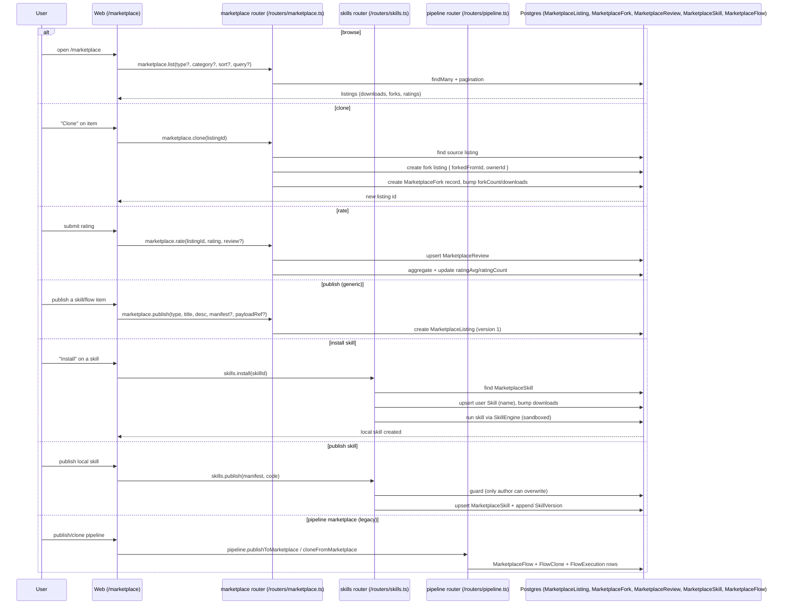

# Marketplace Workflow

How a user browses, clones/installs, and publishes to the marketplace, and how the two marketplaces (generic + pipeline legacy) relate.

## Sequence

## The two marketplaces

1. **Generic** (`marketplace.*`, `apps/api/src/routers/marketplace.ts`): items of type `MarketplaceItemType` (7 types incl. skill, pipeline, workflow, prompt pack, agent template, MCP integration, plugin). Contains `list/getById/clone/search/publish/rate/getTypes/getByOwner/createVersion`. `MarketplaceListing` stores `manifest` and `payloadRef` Json, but only skills have an executable `run` path.
2. **Pipeline legacy** (`pipeline.listMarketplace`/`publishToMarketplace`/`cloneFromMarketplace`/`getMarketplaceById`/`marketplaceCategories`): binds `MarketplaceFlow` to a pipeline. Deleting a pipeline cascades away its `MarketplaceFlow`, clones and executions in a transaction.

They are **not unified** — two clone flows, two listings systems, two search surfaces.

## Skills install/publish detail

- `skills.install(skillId)`: copies `MarketplaceSkill` into the user's own `Skill` (upsert by name), bumps `downloads`. Local skills appear under `/tools` and can be toggled (`Skill.isActive`), and are runnable via `skills.run` / `tools.execute` (sandboxed JS only).
- `skills.publish`: author-guarded (only the current owner can update an existing marketplace skill), appends `SkillVersion`, bumps version.
- Skill execution runs in an `isolated-vm` sandbox via `SkillEngine`; `runtime: "native"` returns "Native runtime not supported via API" — only `sandboxed-js` works end-to-end.

## Ratings / reviews

- `marketplace.rate` upserts `MarketplaceReview` per user and recomputes `ratingAvg`/`ratingCount` on the listing.
- Review moderation (`isVerified`, `isFeatured`) exists as fields but has no admin workflow.

## Frontend

- `apps/web/src/app/marketplace/page.tsx`, `apps/web/src/app/marketplace/[id]/page.tsx`, `apps/web/src/components/marketplace/flow-preview.tsx` (used for previewing pipeline-type marketplace items in a mini canvas).

## Seeding / status

- The marketplace demo/seed data was removed; any admin/marketplace bootstrap is env-gated (no hard-coded seed rows remain in the API startup path), so a fresh install shows an empty catalog until items are published.

## Dead-ends / stubs

- Non-skill item types have no executable payload or install semantics.
- The generic clone flow and the pipeline `cloneFromMarketplace` are separate; cloning a pipeline via generic marketplace does not produce a runnable pipeline in the legacy system.
- No admin moderation or verified-badge workflow.