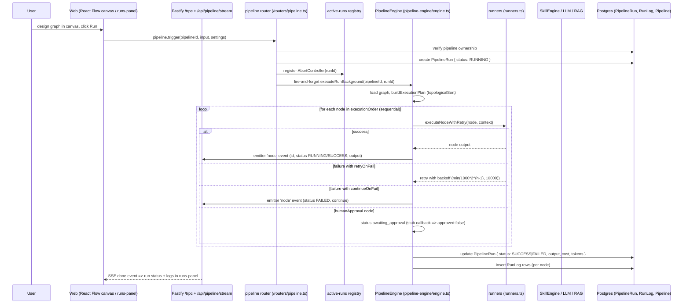

# Pipeline Run Workflow

How a user triggers a pipeline and watches nodes execute end-to-end.

## Sequence

## Who does what

- **Canvas**: `apps/web/src/components/pipeline/` — `pipeline-canvas.tsx` (React Flow), `node-palette.tsx`, `inspector-panel.tsx`, `custom-nodes.tsx`, `runs-panel.tsx`, `template-picker.tsx`. Node kinds come from `apps/web/src/lib/pipeline-node-config.ts` (`NODE_TYPE_MAP`).
- **Trigger entry**: `pipeline.trigger` (`apps/api/src/routers/pipeline.ts`).
- **Registry**: `apps/api/src/services/active-runs.ts` keys an `AbortController` per run; `apps/api/src/services/run-recovery.ts` marks orphaned `RUNNING` runs `FAILED` at boot and every 5 minutes ("Orphaned run recovered after restart").
- **Engine**: `packages/pipeline-engine/src/engine.ts` + `runners.ts` + `graph.ts`:
  - `buildExecutionPlan` produces `executionOrder` via topological sort. Execution is strictly sequential regardless of the `executionOrder: "parallel"` setting (ignored).
  - `executeNodeWithRetry` honors `retryOnFail`/`maxRetries` with capped exponential backoff.
  - `loop` nodes set `$loop.index/item/total` variables; they do **not** re-run downstream per iteration.
  - `parallelFork` emits branch descriptors only; no concurrent branches run.
  - `humanApproval` pauses with `awaiting_approval` unless a `requestApproval` callback or `approvalOverrides` is given — `executeRunBackground` passes a stub that returns `{ approved: false }`.
  - `subPipeline` errors with "not available" (no `subPipelineRunner` provided by the API).
  - `codeExecute` uses isolated-vm and can be disabled via `PIPELINE_CODE_EXECUTE_ENABLED === "false"`.
  - `databaseQuery` is read-only (`assertSafeReadOnlySql`); custom connection strings are rejected.
- **Streaming**: `apps/api/src/services/run-emitters.ts` buffers `node`/`done`/`error` events; raw SSE endpoint `GET /api/pipeline/stream/:runId` (`apps/api/src/index.ts`) replays the buffer and forwards live events, scoped with the same group/ownership check as `getById`.

## Persistence

- `PipelineRun` (status, input/output Json, costCents, tokensIn/Out, startedAt/completedAt).
- `RunLog` per node (nodeId, nodeType, input/output Json, error, duration, tokens, costCents). Cascades with the run.
- `Pipeline` counters (`runCount`, `lastRunAt`, `avgDurationMs`) are updated after the run.

## Cancellation and resume

- `pipeline.cancelRun`: flips run to `CANCELLED`, aborts the controller, emits a `done` event; the background loop re-checks status before continuing.
- `pipeline.resume`: re-runs the **whole graph** from the top applying `approvalOverrides` decisions; it does not resume at the paused node.
- `pipeline.update` snapshots the previous graph into `versionHistory` (cap 50) and bumps `version`; `restoreVersion` rolls back.

## Dead-ends / stubs

- Webhook trigger node: client-side only, returns the configured path, no real HTTP binding.
- Parallel execution: requested via settings but not honored.
- Sub-pipelines: unsupported at runtime.
- `executeNode` (single-node debug) runs a single node with an empty context — precursor inputs are not hydrated.